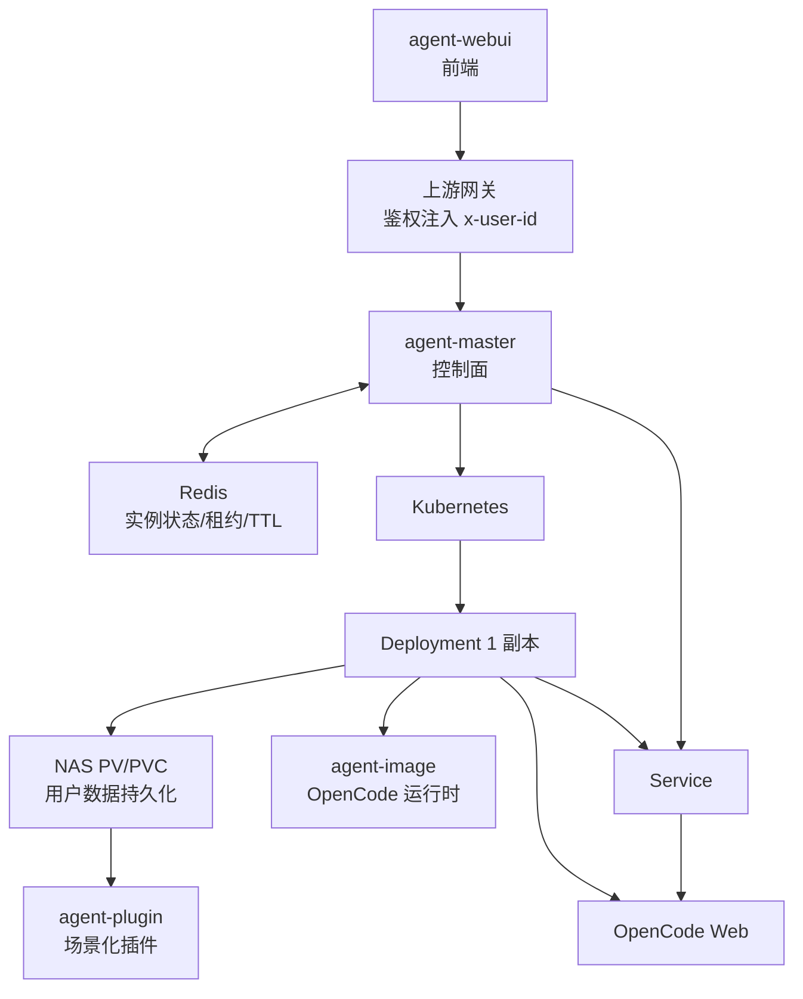
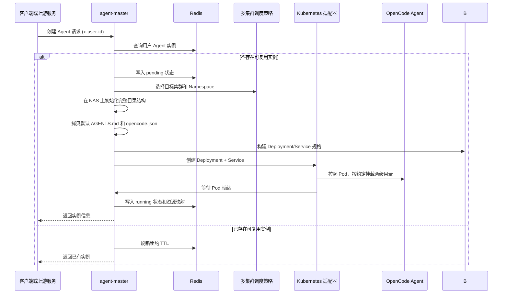

# 分布式多用户 OpenCode 智能体平台架构设计

> **阅读对象**: 架构师、平台工程师、AI 基础设施工程师、OpenCode 二次开发开发者
>
> 本文基于已落地实践，分享一套基于 Kubernetes + OpenCode 的分布式弹性多用户智能体平台架构。核心设计极其简洁，通过两级目录挂载自然满足多用户隔离、数据持久化和能力扩展需求。

---

## 一、背景：我们要解决什么问题

OpenCode 是强大的桌面端 AI 编程助手，但原生设计面向单用户单进程。要把它改造成支持多用户共享的平台级服务，需要解决几个核心问题：

| 问题 | 说明 |
| --- | --- |
| **多用户隔离** | 每个用户的配置、数据、工作区必须隔离，不能互相访问或冲突 |
| **弹性伸缩** | 用户空闲时可以回收容器资源，需要时快速拉起，降低资源浪费 |
| **数据持久化** | Pod 销毁不丢失用户数据，包括配置、缓存、会话记录 |
| **能力扩展** | 平台可以沉淀场景化能力（agents/skills/tools），用户按需选择，不需要修改平台核心代码 |
| **零侵入适配** | 尽可能复用 OpenCode 原生逻辑，不修改核心代码，降低维护成本 |

业界常见方案是把所有用户数据放在统一数据库，再通过复杂的同步逻辑映射到容器文件系统。这套方案不仅复杂，而且容易引入性能瓶颈和一致性问题。

我们的设计走了另一条路：**直接利用 Kubernetes subPath 挂载 + 文件系统分层，让 OpenCode 原生路径自然匹配持久化存储**。

---

## 二、总体架构：控制面与运行面分离

整个平台拆分为四个独立仓库，职责清晰，分离关注点：

| 仓库 | 职责 | 分层 |
| --- | --- | --- |
| **agent-master** | Agent 控制面服务：多 Kubernetes 集群调度、实例生命周期管理、Redis 状态维护、Agent API 统一代理 | **控制面** |
| **agent-image** | OpenCode Runtime 镜像：预构建的 OpenCode 运行环境，由 `agent-master` 调度启动 | **运行面** |
| **agent-webui** | Agent WebUI 前端：提供浏览器访问入口 | **前端界面** |
| **agent-plugin** | 场景化智能体插件集合：agents/skills/tools 插拔式扩展，遵循 OpenCode 插件约定 | **能力扩展** |

总体架构图：



设计原则：

1. **控制面与运行面彻底分离**：`agent-master` 只做调度和代理，不承载推理计算
2. **一个用户一个实例**：每个用户独立 Pod，天然进程隔离，资源配额可按用户分配
3. **弹性由 Kubernetes 负责**：HPA 或 TTL 回收空闲实例，需要时快速拉起
4. **所有用户数据持久化到 NAS**：Pod 销毁数据不丢，下次启动自动恢复
5. **能力扩展走 OpenCode 原生插件机制**：不需要修改平台核心，插拔式增量扩展

---

## 三、核心设计：两级目录挂载

这是整个架构最简洁也最关键的设计点。**整个用户目录是一个 PV/PVC，通过两个 subPath 分别挂载到容器不同位置**。

### 3.1 挂载映射

| 源路径 (NAS) | 容器内路径 | 挂载方式 | 用途 |
| --- | --- | --- | --- |
| `{runtime.workdir}/{userId}/runtime` | `/app` | subPath | 用户**项目工作目录**，包含 `AGENTS.md` 和 `.opencode/` 项目级配置 |
| `{runtime.workdir}/{userId}/global` | `~` (用户家目录) | subPath | 用户**全局数据目录**，完整对应用户主目录结构 |

目录结构可视化：

```text
NAS 用户根目录：{runtime.workdir}/{userId}/
├── runtime/              # → subPath 挂载到容器 /app
│   ├── AGENTS.md          # 用户默认项目规则
│   └── .opencode/         # 用户项目级 OpenCode 配置
│       └── opencode.json  # 可在这里声明 plugin 插件
└── global/               # → subPath 挂载到容器 ~
    └── .config/
        └── opencode/     # OpenCode 全局配置 → ~/.config/opencode
    └── .local/share/
        └── opencode/     # OpenCode 全局数据 → ~/.local/share/opencode
    └── .cache/
        └── opencode/     # provider 包和插件缓存 → ~/.cache/opencode
```

### 3.2 设计思路

OpenCode 本身就有两套配置路径约定：

1. **项目级配置**：当前工作目录下的 `AGENTS.md` + `.opencode/`，默认放在 `/app` 根
2. **全局配置/数据/缓存**：OpenCode 默认从用户家目录 `~` 读取：
   - `~/.config/opencode` - 全局配置
   - `~/.local/share/opencode` - 全局数据（auth.json、会话记录）
   - `~/.cache/opencode` - provider 包和插件缓存

我们直接对这个约定做"物理映射"：

- 用户项目级对应 NAS 上 `{userId}/runtime/`，挂载到容器 `/app`
- 用户全局数据对应 NAS 上 `{userId}/global/`，挂载到容器 `~`

**结论：完全不需要修改 OpenCode 任何一行代码**，所有路径查找逻辑原生匹配。

### 3.3 五大优势

这套设计看似简单，实则解决了五个关键问题：

| 优势 | 说明 |
| --- | --- |
| **1. 天然隔离** | 每个用户独立 PV/PVC，文件系统层面彻底隔离，不会跨用户访问 |
| **2. 零侵入适配** | 完全匹配 OpenCode 默认路径查找规则，不需要改任何核心代码 |
| **3. 完整持久化** | 项目配置、全局配置、认证数据、插件缓存全部持久化，Pod 销毁不丢 |
| **4. 结构清晰** | `runtime` 放项目，`global` 放全局数据，分工明确，易于维护 |
| **5. 无冲突挂载** | 两个 subPath 从同一个 PV 挂载到容器不同路径，完全不冲突 |

对比业界方案：

- 不需要在数据库里存文件，避免了"文件->DB->文件"复杂同步
- 不需要 initContainer 复制数据，启动速度快
- 不需要修改 OpenCode 源码，上游版本更易于跟进
- 所有数据就是普通文件，用户可以直接在 NAS 上查看、修改、备份

---

## 四、插件机制：插拔式能力扩展

平台场景化能力不塞进核心代码，全部通过 OpenCode 原生 `plugin` 机制实现扩展。

### 4.1 设计思路

1. `agent-plugin` 仓库独立维护所有场景化能力：agents、skills、tools
2. 遵循 OpenCode 官方插件格式，插件入口在 `.opencode/plugins/agent-plugin.js`
3. `agent-master` 首次创建用户实例时，从模板拷贝默认 `opencode.json` 到用户 `runtime/.opencode/`
4. 默认模板已经预留 `"plugin": []` 空数组

用户要加载平台提供的场景化插件，只需要在自己项目级 `opencode.json` 添加一行声明：

```json
{
  "$schema": "https://opencode.ai/config.json",
  "model": "...",
  "plugin": ["agent-plugin@git+https://github.com/ArchAIHarness/agent-plugin.git"]
}
```

OpenCode 启动时自动下载插件并缓存到 `~/.cache/opencode`，因为 `~` 已经挂载到 NAS `global/.cache/opencode`，所以缓存会持久化，下次启动不需要重新下载。

### 4.2 优势

| 特性 | 说明 |
| --- | --- |
| **不修改核心** | 新增能力只需要在 `agent-plugin` 添加，不需要发布 `agent-master` 或 `agent-image` |
| **按需加载** | 用户只加载自己需要的插件，不强制全量安装 |
| **版本可控** | 用户可以指定插件版本分支，自主决定升级时机 |
| **独立演化** | 插件仓库和平台核心仓库独立演进，互不干扰 |
| **生态开放** | 第三方也可以发布自己的插件仓库，用户直接引用 |

### 4.3 插件仓库结构

`agent-plugin` 遵循 OpenCode 插件约定：

```text
agent-plugin/
├── package.json
├── README.md
├── AGENTS.md
├── .opencode/
│   └── plugins/
│       └── agent-plugin.js  # OpenCode 插件入口
├── agents/
│   └── *.md            # 场景化 Agent 定义
├── skills/
│   └── {domain}/
│       └── {skill-name}/
│           └── SKILL.md
└── tools/
    └── {domain}/
        └── *.js        # 自定义工具实现
```

插件入口只做两件事：

1. 将本仓库 `skills/` 加入 OpenCode 技能搜索路径
2. 注册 `agents/` 下的所有场景化 Agent 定义

不覆盖用户已有配置，完全增量扩展。

---

## 五、部署与运行流程

### 5.1 首次创建用户实例



**关键初始化步骤**：

1. Kubernetes `subPath` 挂载要求源路径必须提前存在，否则 K8s 会用 root 权限自动创建，导致权限问题
2. 因此 `agent-master` 在创建 Pod **之前**，必须先在 NAS 上初始化完整目录结构
3. 新用户初始化：创建 `runtime/` + `global/` 三级目录 + 拷贝默认文件 + 设置正确权限
4. 重启实例：只做目录存在性检查，绝对不覆盖用户已修改的 `AGENTS.md` 和 `opencode.json`

### 5.2 API 代理流程

`agent-master` 对 OpenCode 所有接口做透明代理：

1. 从 `x-user-id` 找到对应用户 Agent 实例
2. 去掉 `/agent` 前缀，保留原始路径、方法、查询参数、请求体
3. 转发到对应 Kubernetes Service
4. 将响应返回给客户端

`directory` 是 OpenCode 官方 query 参数，`agent-master` 完全透明透传，不做任何处理。

### 5.3 资源回收

- Redis 中每个实例记录带 TTL（默认 1 小时）
- 有活跃请求时持续刷新 TTL
- TTL 过期后，`agent-master` 自动删除对应 Deployment + Service，清理 Redis 记录
- 用户数据仍然保留在 NAS，下次创建实例直接复用

---

## 六、总结：简洁即美

这套架构的核心启示是：**理解并尊重软件原有路径约定，通过文件系统分层和挂载映射自然解决问题，比复杂的抽象和转换更有效**。

设计亮点：

1. **控制面运行面分离**：控制面负责调度生命周期，运行面负责实际推理，职责清晰，可独立伸缩
2. **两级挂载设计**：`runtime` 放项目，`global` 放全局，完美匹配 OpenCode 原生路径，零侵入
3. **完整持久化**：所有用户数据都在 NAS，Pod 销毁不丢，重启自动恢复
4. **天然多租户隔离**：每个用户独立 PV，文件系统层面彻底隔离
5. **插拔式插件**：能力扩展不碰核心，用户按需加载，独立演进
6. **弹性复用**：空闲实例自动回收，资源利用率高

为什么这套架构能工作得很好？

因为它**没有去"重新发明轮子"**。OpenCode 已经设计了清晰的项目级/全局级路径约定，Kubernetes 已经提供了成熟的 PV/PVC/subPath 能力，我们只是把它们用一种极其简洁的方式组合起来，就解决了多用户分布式平台的核心问题。

越简洁，越健壮。

---

## 相关仓库

- [agent-master](https://github.com/ArchAIHarness/agent-master) - Agent 控制面服务
- [agent-image](https://github.com/ArchAIHarness/agent-image) - OpenCode Runtime 镜像
- [agent-webui](https://github.com/ArchAIHarness/agent-webui) - Agent WebUI 前端
- [agent-plugin](https://github.com/ArchAIHarness/agent-plugin) - 场景化智能体插件集合