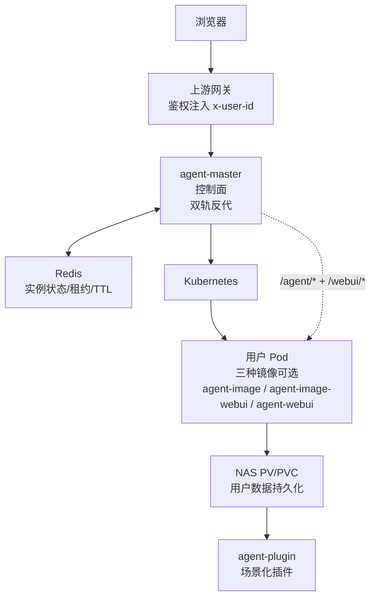
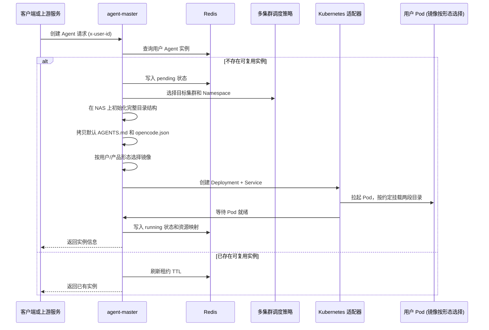

# 分布式多用户 OpenCode 智能体平台架构设计

> **阅读对象**: 架构师、平台工程师、AI 基础设施工程师、OpenCode 二次开发开发者
>
> 本文基于已落地实践，分享一套基于 Kubernetes + OpenCode 的分布式弹性多用户智能体平台架构。整套设计围绕两根支柱展开：**两段挂载**解决数据持久化与多用户隔离，**双轨交互**解决多形态 WebUI 与控制面统一接入。两根支柱合在一起，让 OpenCode 这个原本面向单用户单进程的工具，在不修改任何核心代码的前提下，跑成了一个支持多用户、可弹性伸缩、形态可选的平台级服务。

---

## 一、背景：我们要解决什么问题

OpenCode 是强大的桌面端 AI 编程助手，但原生设计面向单用户单进程。要把它改造成支持多用户共享的平台级服务，需要同时解决两类问题：

**第一类：数据与运行问题**

| 问题 | 说明 |
| --- | --- |
| **多用户隔离** | 每个用户的配置、数据、工作区必须隔离，不能互相访问或冲突 |
| **弹性伸缩** | 用户空闲时可以回收容器资源，需要时快速拉起，降低资源浪费 |
| **数据持久化** | Pod 销毁不丢失用户数据，包括配置、缓存、会话记录 |
| **能力扩展** | 平台可以沉淀场景化能力（agents/skills/tools），用户按需选择，不需要修改平台核心代码 |
| **零侵入适配** | 尽可能复用 OpenCode 原生逻辑，不修改核心代码，降低维护成本 |

**第二类：交互与形态问题**

| 问题 | 说明 |
| --- | --- |
| **统一接入** | 用户从浏览器到 OpenCode 之间，需要一个统一入口承载鉴权、调度、反向代理 |
| **多形态共存** | 不同用户、不同场景需要不同的交互形态：有人要"打开就用"，有人要"完整 IDE 沉浸式编程" |
| **AI 原生交互** | 富 UI、工具结果可视化、双向流式对话，不能只靠传统 REST + 静态页面 |
| **演进路径** | 平台能从轻量形态平滑演进到重度形态，不强制用户一次性切换 |

业界常见方案要么把所有用户数据塞进数据库再复杂同步到容器，要么直接给每个用户一台 VM。前者在性能和一致性上踩坑，后者资源浪费严重。我们走了另一条路：

- **数据问题**：直接利用 Kubernetes subPath 挂载 + 文件系统分层，让 OpenCode 原生路径自然匹配持久化存储
- **交互问题**：控制面做双轨反代，运行面提供两种 WebUI 镜像形态共存，按用户/场景选择

---

## 二、总体架构：控制面 / 运行面 / 能力面 三分

整个平台拆分为五个独立仓库，按"控制面 - 运行面 - 能力面"三层组织，职责清晰：

| 仓库 | 职责 | 分层 |
| --- | --- | --- |
| **agent-master** | Agent 控制面服务：多 Kubernetes 集群调度、实例生命周期管理、Redis 状态维护、`/agent/*` 与 `/webui/*` 双轨反代 | **控制面** |
| **agent-image** | 无头 OpenCode Runtime 镜像：仅 OpenCode Web，单进程 | **运行面 · 无头** |
| **agent-image-webui** | 即开即用 WebUI 镜像：OpenCode Web + AionUi WebUI 双进程，supervisord 编排 | **运行面 · 即开即用** |
| **agent-webui** | 重度沉浸 WebUI 镜像：基于 OpenSumi core 自研 Agent IDE，AG-UI 协议接 OpenCode；仓库内置 Dockerfile，构建出 OpenCode + OpenSumi IDE 双进程镜像 | **运行面 · 重度沉浸** |
| **agent-plugin** | 场景化智能体插件集合：agents/skills/tools 插拔式扩展，遵循 OpenCode 插件约定 | **能力扩展** |

总体架构图：



设计原则：

1. **控制面与运行面彻底分离**：`agent-master` 只做调度和反代，不承载推理计算
2. **一个用户一个 Pod**：每个用户独立 Pod，天然进程隔离，资源配额可按用户分配
3. **运行面镜像可选**：按用户/产品形态选 `agent-image`、`agent-image-webui` 或 `agent-webui`
4. **弹性由 Kubernetes 负责**：HPA 或 TTL 回收空闲实例，需要时快速拉起
5. **所有用户数据持久化到 NAS**：Pod 销毁数据不丢，下次启动自动恢复
6. **能力扩展走 OpenCode 原生插件机制**：不需要修改平台核心，插拔式增量扩展

接下来分别展开两根支柱：第三章讲数据侧的两段挂载，第四章讲交互侧的双轨反代与多形态 WebUI。

---

## 三、支柱一：两段挂载 —— 数据持久化与多用户隔离

这是整个架构最简洁也最关键的设计点。**整个用户目录是一个 PV/PVC，通过两个 subPath 分别挂载到容器不同位置**。

### 3.1 挂载映射

| 源路径 (NAS) | 容器内路径 | 挂载方式 | 用途 |
| --- | --- | --- | --- |
| `{runtime.workdir}/{userId}/runtime` | `/app` | subPath | 用户**项目工作目录**，包含 `AGENTS.md` 和 `.opencode/` 项目级配置 |
| `{runtime.workdir}/{userId}/global` | `~` (用户家目录) | subPath | 用户**全局数据目录**，完整对应用户主目录结构 |

目录结构可视化：

```text
NAS 用户根目录：{runtime.workdir}/{userId}/
runtime/                    # subPath 挂载到容器 /app
  AGENTS.md                 # 用户默认项目规则
  .opencode/                # 用户项目级 OpenCode 配置
    opencode.json           # 可在这里声明 plugin 插件
global/                     # subPath 挂载到容器 ~
  .config/opencode/         # 全局配置  -> ~/.config/opencode
  .local/share/opencode/    # 全局数据  -> ~/.local/share/opencode
  .cache/opencode/          # provider 包和插件缓存 -> ~/.cache/opencode
```

### 3.2 设计思路

OpenCode 本身就有两套配置路径约定：

1. **项目级配置**：当前工作目录下的 `AGENTS.md` + `.opencode/`，默认放在 `/app` 根
2. **全局配置/数据/缓存**：OpenCode 默认从用户家目录 `~` 读取

我们直接对这个约定做"物理映射"：

- 用户项目级对应 NAS 上 `{userId}/runtime/`，挂载到容器 `/app`
- 用户全局数据对应 NAS 上 `{userId}/global/`，挂载到容器 `~`

**结论：完全不需要修改 OpenCode 任何一行代码**，所有路径查找逻辑原生匹配。

### 3.3 五大优势

| 优势 | 说明 |
| --- | --- |
| **1. 天然隔离** | 每个用户独立 PV/PVC，文件系统层面彻底隔离，不会跨用户访问 |
| **2. 零侵入适配** | 完全匹配 OpenCode 默认路径查找规则，不需要改任何核心代码 |
| **3. 完整持久化** | 项目配置、全局配置、认证数据、插件缓存全部持久化，Pod 销毁不丢 |
| **4. 结构清晰** | `runtime` 放项目，`global` 放全局数据，分工明确，易于维护 |
| **5. 无冲突挂载** | 两个 subPath 从同一个 PV 挂载到容器不同路径，完全不冲突 |

对比业界方案：

- 不需要在数据库里存文件，避免了"文件 -> DB -> 文件"复杂同步
- 不需要 initContainer 复制数据，启动速度快
- 不需要修改 OpenCode 源码，上游版本更易于跟进
- 所有数据就是普通文件，用户可以直接在 NAS 上查看、修改、备份

### 3.4 关键约束

Kubernetes `subPath` 挂载要求**源路径必须提前存在**，否则 K8s 会用 root 权限自动创建，导致权限问题。

因此 `agent-master` 在创建 Pod **之前**必须先在 NAS 上初始化完整目录结构：

- 新用户：创建 `runtime/` + `global/` 三级目录 + 拷贝默认 `AGENTS.md` 与 `opencode.json` + 设置正确权限
- 重启实例：只做目录存在性检查，**绝对不覆盖用户已修改的项目级配置**

---

## 四、支柱二：双轨反代 —— 多形态 WebUI 与统一接入

第一根支柱解决了"数据怎么活下来"，第二根支柱解决"用户怎么进得去、用什么形态用"。

### 4.1 双轨反代

`agent-master` 对外只暴露一个域名，对内维护两条反向代理路径：

| Master 路径 | 转发目标 | 协议 | 备注 |
| --- | --- | --- | --- |
| `/agent/*` | `<runtime-svc>:4096/*` | HTTP / SSE / WebSocket | OpenCode Web API，所有镜像都有 |
| `/webui/*` | `<runtime-svc>:3000/*` | HTTP / SSE / WebSocket | WebUI 资产 + AI 原生交互流，仅 WebUI 镜像有 |

要点：

1. **`/agent/*` 是 OpenCode 既有协议入口**，承担会话管理、消息流、工具调用等所有控制面以下的实际能力。三种镜像都暴露这条路径。
2. **`/webui/*` 是浏览器交互入口**，承担 SPA 资产、富 UI 静态资源、AI 原生事件流。无头镜像不需要这条路径，WebUI 镜像才有。
3. 反代必须支持 SSE 与 WebSocket Upgrade，且必须剥离上游网关注入的 `Authorization`、`x-user-id` 等内部 Header，不透传给容器内进程。
4. 容器内进程只信任来自 `agent-master` 的入站，靠 NetworkPolicy 限制，不暴露公网。
5. 鉴权由上游网关 + `agent-master` 完成，用户 Pod 内部不自验签；隔离由 Pod 边界保证，不在应用层做多租户路由。

### 4.2 三种镜像形态

运行面提供三种镜像，按场景选择：

| 镜像 | 进程构成 | 适用场景 | 特点 |
| --- | --- | --- | --- |
| **agent-image** | OpenCode Web 单进程 | API/SDK 集成、CI 调用、自动化任务 | 最小镜像，资源占用最低，没有浏览器入口 |
| **agent-image-webui** | OpenCode Web + AionUi（supervisord 双进程） | C 端用户即开即用、轻量浏览器交互 | 自带聊天界面，开箱即用，体验接近 ChatGPT 类产品 |
| **agent-webui** | OpenCode Web + OpenSumi 自研 IDE（supervisord 双进程） | 重度开发者、需要完整 IDE + 富 UI 沉浸式编程 | 基于 OpenSumi core，复用 vscode 扩展生态，AG-UI 协议双向交互 |

三种镜像的 `/agent/*` 行为完全一致，因此**`agent-master` 控制面逻辑不变**，只在创建 Pod 时按用户/产品形态选择镜像即可。WebUI 镜像额外暴露 `/webui/*`，Pod 内 supervisord 同时管理 OpenCode 与 WebUI 进程。

### 4.3 关键设计：交互层为什么要分两种 WebUI

不分形态会出现两个矛盾：

- **轻量用户**：只想问个问题、看个回答，不需要项目树、终端、扩展。给一个 IDE 反而抬高使用门槛。
- **重度用户**：要在浏览器里写代码、跑命令、看 PDF、改图、装扩展、用 Agent 帮忙重构。给一个聊天框完全不够。

两种用户的诉求**不只是 UI 大小不同，而是交互模型完全不同**：

| 维度 | agent-image-webui (AionUi) | agent-webui (OpenSumi) |
| --- | --- | --- |
| **核心隐喻** | 聊天 | IDE |
| **主交互单元** | 消息气泡 | 文件、终端、面板、编辑器 |
| **学习曲线** | 几乎为零 | 接近 vscode |
| **扩展机制** | 应用内置 | vscode 扩展 + OpenSumi Module |
| **协议层** | 应用私有协议消费 OpenCode API | AG-UI 协议（开源标准）+ MCP-UI 富 UI |
| **富 UI 上限** | 受限于内置组件 | Tiptap、PDF、Mermaid、MCP-UI Renderer，自由扩展 |
| **演进路径** | 平台兜底入口，长期共存 | 重度形态最终默认入口 |

把两种形态拆成两个镜像，平台不需要做"模式切换"——切换镜像就是切换形态。一个用户在不同时段甚至可以选不同镜像，数据通过两段挂载共享，无缝切换。

### 4.4 AI 原生交互：AG-UI + MCP-UI

`agent-webui` 内部采用两个开源协议来承载 AI 原生交互，不发明私有协议：

- **AG-UI**：Agent 与 UI 之间的事件流协议，承载消息流、工具调用、中断、输入回填、状态同步等会话级事件。一条 SSE 流双向打通 OpenCode 与 IDE。
- **MCP-UI**：MCP 工具调用结果的富 UI 标准。工具不再只返回 JSON，而是可以返回受控的 HTML 片段、表单、图表，由 IDE 端 Renderer 安全渲染。

这两层协议让"Agent 能直接画出可点击的 UI"成为常规操作，不再需要为每个工具单独写前端组件。

### 4.5 形态选择策略

`agent-master` 在创建用户 Pod 时按下表选择镜像：

| 触发条件 | 选择镜像 |
| --- | --- |
| 来自 SDK / OpenAPI / 内部服务 | `agent-image` |
| 来自标准 C 端浏览器入口 | `agent-image-webui` |
| 来自开发者工作台、需要完整 IDE 或装扩展 | `agent-webui` |

策略由 `agent-master` 自行维护，运行面镜像之间不耦合。**三种镜像可在同一个集群、同一个 NAS 上长期共存**，用户在不同时段选择不同镜像，数据通过两段挂载共享。

---

## 五、能力扩展：插拔式插件机制

平台场景化能力不塞进核心代码，全部通过 OpenCode 原生 `plugin` 机制实现扩展。

### 5.1 设计思路

1. `agent-plugin` 仓库独立维护所有场景化能力：agents、skills、tools
2. 遵循 OpenCode 官方插件格式，插件入口在 `.opencode/plugins/agent-plugin.js`
3. `agent-master` 首次创建用户实例时，从模板拷贝默认 `opencode.json` 到用户 `runtime/.opencode/`
4. 默认模板已经预留 `"plugin": []` 空数组

用户要加载平台提供的场景化插件，只需要在自己项目级 `opencode.json` 添加一行声明：

```json
{
  "$schema": "https://opencode.ai/config.json",
  "model": "...",
  "plugin": ["agent-plugin@git+https://github.com/ArchAIHarness/agent-plugin.git"]
}
```

OpenCode 启动时自动下载插件并缓存到 `~/.cache/opencode`，因为 `~` 已经挂载到 NAS `global/.cache/opencode`，所以缓存会持久化，下次启动不需要重新下载。

### 5.2 优势

| 特性 | 说明 |
| --- | --- |
| **不修改核心** | 新增能力只需要在 `agent-plugin` 添加，不需要发布 `agent-master` 或运行面镜像 |
| **按需加载** | 用户只加载自己需要的插件，不强制全量安装 |
| **版本可控** | 用户可以指定插件版本分支，自主决定升级时机 |
| **独立演化** | 插件仓库和平台核心仓库独立演进，互不干扰 |
| **生态开放** | 第三方也可以发布自己的插件仓库，用户直接引用 |

### 5.3 与 WebUI 的协同

- 在 `agent-image-webui` 形态下，插件能力通过 OpenCode 原生 chat 触发，AionUi 直接呈现结果。
- 在 `agent-webui` 形态下，插件除了在 chat 里被调用，还能借助 MCP-UI 返回富 UI 结果（表格、图、表单），由 OpenSumi IDE 内的 Renderer 渲染，体验显著超越纯文本。

**插件本身不区分 WebUI**，所有能力对所有形态可用，富 UI 增强是 WebUI 镜像的额外收益。

---

## 六、部署与运行流程

### 6.1 首次创建用户实例



### 6.2 双轨反代流程

`agent-master` 对两条路径分别处理：

- **`/agent/*`**：从 `x-user-id` 找到实例，去掉 `/agent` 前缀，转发到 Service 的 4096 端口；OpenCode 官方 `directory` 等 query 参数完全透明透传。
- **`/webui/*`**：同样按用户路由到对应 Pod，转发到 Service 的 3000 端口；保持 SSE 与 WebSocket Upgrade，子路径前缀 `/webui` 在 WebUI 进程内适配。

只有 WebUI 镜像才会被 `/webui/*` 命中；`agent-image` 形态下该路径直接 404，符合预期。

### 6.3 资源回收

- Redis 中每个实例记录带 TTL（默认 1 小时）
- 有活跃请求时持续刷新 TTL（`/agent/*` 与 `/webui/*` 任一活跃都视作有效）
- TTL 过期后，`agent-master` 自动删除对应 Deployment + Service，清理 Redis 记录
- 用户数据仍然保留在 NAS，下次创建实例直接复用

---

## 七、总结：两根支柱，简洁即美

这套架构的核心启示是：**理解并尊重软件原有约定，通过文件系统分层与协议分层自然解决问题，比复杂的抽象和转换更有效**。

两根支柱合在一起：

**支柱一·两段挂载**

1. `runtime/` 放项目，`global/` 放全局，完美匹配 OpenCode 原生路径，零侵入
2. 每个用户独立 PV，文件系统层面彻底隔离
3. 所有用户数据持久化到 NAS，Pod 销毁不丢，重启自动恢复

**支柱二·双轨交互**

1. `/agent/*` 走 OpenCode Web API，所有镜像统一支持
2. `/webui/*` 走浏览器交互，两种 WebUI 镜像分别对应即开即用与重度沉浸
3. AG-UI + MCP-UI 提供 AI 原生交互能力，不发明私有协议
4. 形态切换 = 镜像切换，数据通过两段挂载共享，平滑无缝

**配套·插拔式插件**

1. 能力扩展不碰核心，用户按需加载，独立演进
2. 插件能力对所有镜像形态可用，WebUI 镜像额外获得富 UI 增强

为什么这套架构能工作得很好？

因为它**没有去"重新发明轮子"**：

- OpenCode 已经设计了清晰的项目级/全局级路径约定
- Kubernetes 已经提供了成熟的 PV/PVC/subPath 能力
- AG-UI 与 MCP-UI 已经把"Agent 与 UI 之间怎么通信"标准化
- vscode / OpenSumi 已经把 IDE 扩展生态打磨到位

我们做的事情，是用一种极其简洁的方式把它们组合起来。**两段挂载承接数据，双轨反代承接交互，原生插件承接能力**——一座平台就立了起来。

越简洁，越健壮。

---

## 相关仓库

- [agent-master](https://github.com/ArchAIHarness/agent-master) - Agent 控制面服务
- [agent-image](https://github.com/ArchAIHarness/agent-image) - 无头 OpenCode Runtime 镜像
- [agent-image-webui](https://github.com/ArchAIHarness/agent-image-webui) - 即开即用 WebUI 镜像（OpenCode + AionUi）
- [agent-webui](https://github.com/ArchAIHarness/agent-webui) - 重度沉浸 WebUI 镜像（OpenCode + OpenSumi 自研 IDE，AG-UI 协议）
- [agent-plugin](https://github.com/ArchAIHarness/agent-plugin) - 场景化智能体插件集合
