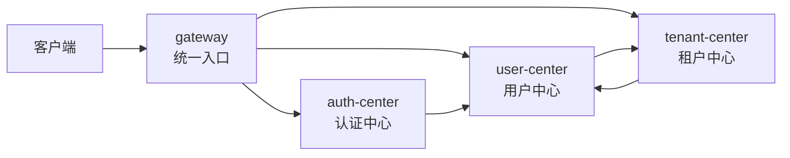
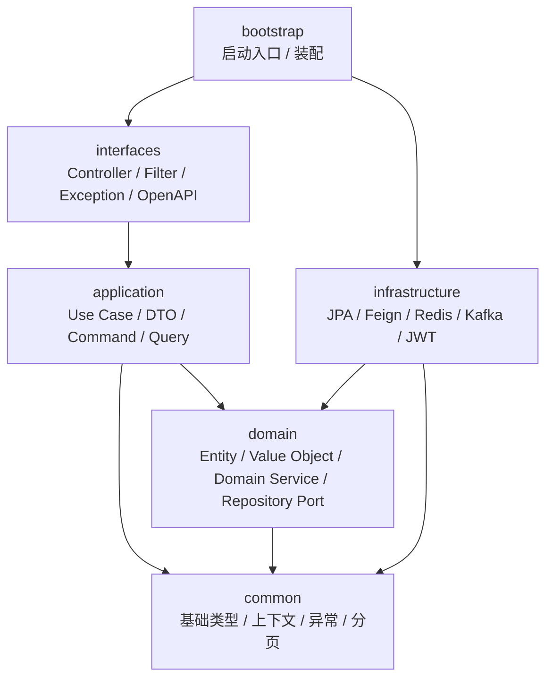
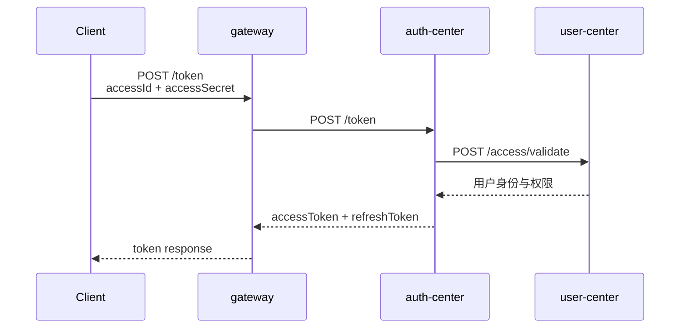
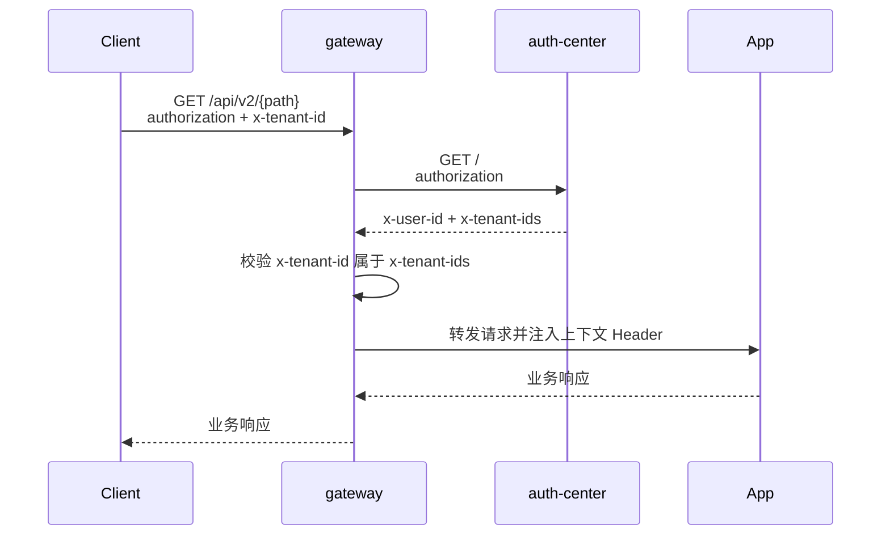
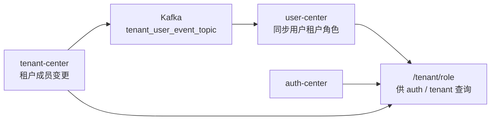

# 多租户 SaaS 内核设计方案

> **阅读对象**:架构师、平台工程师、后端工程师、AI 编程代理
> **前置阅读**:[DDD + 多租户架构模式](../0xC0_实践模式/DDD多租户架构模式.md)、[企业 SSO 接入设计模式](../0xC0_实践模式/企业SSO接入设计模式.md)
>
> 本文定义由 `gateway`、`auth-center`、`user-center`、`tenant-center` 组成的最小闭环多租户 SaaS 内核。

## 一、设计目标

多租户 SaaS 内核是一组面向上层应用复用的核心平台能力。它把身份认证、租户隔离、访问控制、上下文传递和网关治理沉淀为稳定内核,让上层应用只关注自身领域模型。

| 命题 | 说明 |
| --- | --- |
| 统一入口 | 所有外部请求从网关进入,统一完成认证、租户校验、上下文注入 |
| 统一身份 | 用户、访问密钥、令牌、OAuth、SSO 由认证中心统一处理 |
| 统一用户 | 账号、角色、访问密钥、用户侧租户权限由用户中心统一管理 |
| 统一租户 | 租户、租户成员、班级/组织关系由租户中心统一维护 |
| 统一上下文 | 服务间传递 `x-user-id`、`x-tenant-id`、`x-tenant-ids` 等小写 Header |

## 二、系统边界

| 仓库 | 定位 | 独立部署 | 独立数据库 | 核心职责 |
| --- | --- | --- | --- | --- |
| `gateway` | 统一 API 网关 | 是 | 否 | 路由、认证编排、租户校验、Header 注入 |
| `auth-center` | 认证授权服务 | 是 | 是 | Token、OAuth、SSO、令牌校验 |
| `user-center` | 用户与访问密钥服务 | 是 | 是 | 用户、角色、AK/SK、用户租户权限视图 |
| `tenant-center` | 租户与成员关系服务 | 是 | 是 | 租户、成员、角色、班级/组织关系 |

四个仓库保持独立,避免把平台内核做成巨石仓库。它们通过 HTTP、Feign、Kafka 事件和标准 Header 协作。

`auth-center`、`user-center`、`tenant-center` 统一采用 DDD 分层:

分层红线:

- `domain` 不依赖 Spring、JPA、Web。
- `application` 不依赖 `infrastructure` 和 `interfaces`。
- `interfaces` 不直接注入 Repository。
- `infrastructure` 承担所有外部技术实现。
- `bootstrap` 只负责启动与装配。

## 三、核心调用链

### 3.1 Token 签发

`auth-center` 负责签发令牌,`user-center` 负责校验 AK/SK 与返回用户基础权限。

### 3.2 请求认证

网关必须完成认证、租户校验、上下文注入三件事。上层应用不得信任外部直连请求携带的用户与租户 Header。

### 3.3 租户成员同步

租户侧是成员关系的业务源头,用户侧保存便于认证与权限查询的用户视角数据。事件失败时通过补偿任务或管理接口重放,不能绕开领域模型直接改库。

## 四、上下文 Header 规范

| Header | 来源 | 说明 |
| --- | --- | --- |
| `authorization` | 客户端 | Bearer Token |
| `x-user-id` | `auth-center` / `gateway` | 当前登录用户 ID |
| `x-tenant-id` | 客户端选择 + 网关校验 | 当前请求租户 |
| `x-tenant-ids` | `auth-center` 返回 | 当前用户可访问租户集合 |
| `x-trace-id` | 网关或入口层 | 链路追踪 ID |
| `x-access-id` | 客户端或内部调用 | AK/SK 相关访问标识 |

所有上下文 Header 必须小写。禁止 `X-User-Id`、`X-Tenant-Id` 等大小写混用形式。服务间 Feign 调用只传播 `x-` 前缀上下文 Header。

## 五、服务职责

### 5.1 gateway

- 统一 `/api/v2/**` 入口。
- 调用 `auth-center` 完成 token introspection。
- 校验 `x-tenant-id` 是否属于 `x-tenant-ids`。
- 向后端写入 `x-user-id`、`x-tenant-id`、`x-tenant-ids`。
- 保持全反应式链路,不使用阻塞调用。
- 不在本地验签 JWT,不硬编码业务权限,扩展点通过 SPI 编排。

### 5.2 auth-center

- AK/SK 换取访问令牌。
- 访问令牌校验与刷新。
- OAuth 授权码模式。
- SSO 登录与跨子域 Cookie 写入。
- 聚合用户租户权限并返回给网关。
- SSO Cookie 保留 JavaScript `document.cookie` 写入方案,不使用 Servlet `response.addCookie()`。

### 5.3 user-center

- 用户账号与基础资料。
- AK/SK 生成、校验与轮换。
- 用户角色与权限视图。
- 用户可访问租户列表查询。
- 对 `auth-center` 提供 `/access/validate`、`/access/access_secret`、`/tenant/role`。
- 访问密钥明文不得落库,真实密钥不得进入仓库。

### 5.4 tenant-center

- 租户创建、启停、可见性管理。
- 租户成员加入、移除、角色变更。
- 班级/组织等租户内结构管理。
- 租户成员事件发布。
- 通过 Feign 查询用户侧角色视图。
- 租户成员变更必须通过领域服务和事件发布完成。

## 六、数据与运行依赖

| 服务 | 核心表 | 数据定位 |
| --- | --- | --- |
| `auth-center` | `t_access_token`、`t_auth_code` | 令牌与授权码状态 |
| `user-center` | 用户、账号、访问密钥、用户角色 | 用户主数据与访问凭据 |
| `tenant-center` | `t_tenant`、`t_tenant_user`、`t_tenant_user_role`、`t_class`、`t_role_scope` | 租户与成员关系 |

每个服务独立数据库 Schema,禁止跨服务直接查表。跨服务读写必须通过 API、事件或只读契约完成。

运行依赖:

- MySQL:每个中心独立库或独立 Schema。
- Redis:缓存 token、权限视图、分布式锁。
- Kafka:领域事件与租户成员同步。
- Kubernetes:服务发现、配置注入、滚动发布。

## 七、API 路由规划

| 外部路径 | 目标服务 | 说明 |
| --- | --- | --- |
| `/token` | `auth-center` | 创建访问令牌 |
| `/refresh_token` | `auth-center` | 刷新访问令牌 |
| `/userinfo` | `auth-center` | 获取当前用户信息 |
| `/oauth/**` | `auth-center` | OAuth 授权链路 |
| `/sso/**` | `auth-center` | SSO 登录链路 |
| `/api/v2/user/**` | `user-center` | 用户与访问密钥能力 |
| `/api/v2/tenant/**` | `tenant-center` | 租户、成员、班级能力 |

| 调用方 | 被调用方 | 契约 |
| --- | --- | --- |
| `auth-center` | `user-center` | `/access/validate`、`/access/access_secret`、`/tenant/role` |
| `tenant-center` | `user-center` | `/tenant/role` |
| `gateway` | `auth-center` | `GET /` token introspection |
| `user-center` | `tenant-center` | 通过事件或查询契约获取租户关系 |

## 八、安全设计

### 8.1 密钥治理

- `auth.secret` 不允许有真实默认值。
- 数据库密码、Redis 密码、Webhook Token 不进入仓库。
- 示例配置只能使用占位符。
- GitHub Actions 中的通知 Webhook 使用 Secrets 注入。

### 8.2 租户隔离

多租户隔离由三层共同保证:

1. 网关层校验请求租户是否属于用户租户集合。
2. 应用层所有用例显式接收租户上下文。
3. 数据层所有租户数据带 `tenant_id` 条件。

任何只依赖前端传参的租户隔离都是无效隔离。

### 8.3 SSO 安全

SSO 需要兼顾跨子域登录体验与浏览器 Cookie 策略。若需要使用 `.example.com` 形式的共享 Cookie Domain,服务端不得使用 Tomcat `response.addCookie()` 写入,应保留 JavaScript `document.cookie` 方案,并配套 `Secure`、`SameSite`、短有效期与签名校验。

## 九、迁移与仓库化策略

本次同步只迁移四个必需模块:

- `gateway`
- `auth-center`
- `user-center`
- `tenant-center`

本文档只定义 SaaS 内核本身,不展开任何具体上层业务服务。上层应用后续按统一认证、租户上下文和网关规范独立接入。

迁移时必须脱敏:

| 类型 | 处理方式 |
| --- | --- |
| 数据库密码 | 替换为环境变量占位符 |
| JWT Secret | 替换为环境变量占位符 |
| Redis 密码 | 替换为环境变量占位符 |
| DingTalk / Feishu Webhook Token | 删除或改为 GitHub Secrets 引用 |
| 私有域名 | 改为示例域名或配置项说明 |
| 构建产物 | 不入库 |
| `.git/` | 不复制历史仓库元数据 |

每个仓库应至少具备 `README.md`、`AGENTS.md`、`Dockerfile`、`.gitignore`、`ddl.sql`、安全配置占位符和可执行构建验证。

## 十、验收标准

| 维度 | 标准 |
| --- | --- |
| 构建 | 四个仓库均可独立 `mvn clean package` |
| 安全 | 无真实密码、Token、Webhook、私有凭据入库 |
| 架构 | DDD 分层依赖不倒置,网关保持 SPI 编排 |
| 认证 | AK/SK 可换 token,token 可被网关 introspection |
| 租户 | `x-tenant-id` 必须经过网关校验后进入上层应用 |
| 文档 | README 能说明定位、启动、接口、部署与闭环链路 |

## 总结

`gateway + auth-center + user-center + tenant-center` 构成多租户 SaaS 的最小可用内核。它不是业务功能合集,而是身份、租户、访问控制和上下文治理的工程秩序。只有先把这四个中心闭环打稳,上层应用才能在统一规则下安全扩展。
