# 沙箱工作空间文件系统设计方案

> **阅读对象**:平台工程师、沙箱系统设计者、AI IDE 架构师
> **前置阅读**:[OpenCode 全体系深度解析](../0xD0_实践指南/OpenCode全体系深度解析.md)
>
> 本文系统化拆解面向沙箱环境的轻量级版本化文件系统设计。

---

## 前言

工作空间，本质是一套**复刻 Git 底层核心对象模型、剔除冗余概念、具备强边界隔离的轻量级版本化文件系统**。

Git 的核心价值，源于 Blob、Tree、Commit 三层对象模型——以哈希寻址实现内容去重，以树形结构记录文件快照，以提交链形成完整变更历史。但标准 Git 附带分支、合并、远程、引用等大量拓展能力，同时依赖外部二进制程序，概念繁杂、部署笨重，不适用于轻量化、强隔离、跨语言调用的基础文件服务场景。

工作空间完全继承 Git 三层对象内核，彻底剥离无关拓展能力，不依赖任何外部程序，通过纯自研实现**版本快照、变更追溯、环境回滚**三大核心能力。系统最核心的设计，是构建严格的**空间边界**，将整个文件环境划分为业务区与系统区，边界物理隔离、权限隔离、逻辑隔离，各司其职互不干扰。

---

## 一、设计哲学：取 Git 精华，去 Git 冗余

### 本章要点

| 核心概念 | 一句话说明 |
|---------|-----------|
| Git 三层对象模型 | Blob 存内容、Tree 存结构、Commit 存变更，三层构成版本化内核 |
| 精简取舍 | 保留核心对象模型，剔除分支/合并/远程等全部拓展能力 |
| 纯自研实现 | 不依赖外部二进制，无语言绑定，HTTP REST 标准通信 |

### 1.1 Git 核心对象模型

Git 的版本化能力，本质上由三层对象模型驱动，每一层各司其职：

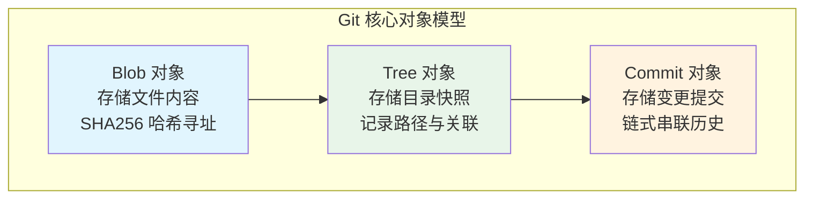

| 对象 | 职责 | 标识方式 |
|------|------|---------|
| **Blob** | 存储单个文件的完整内容 | SHA256 内容哈希 |
| **Tree** | 记录某一时刻的全量目录结构 | 关联路径 + Blob 哈希 |
| **Commit** | 记录一次完整变更 | 链式哈希指向父提交 |

### 1.2 工作空间的精简取舍

标准 Git 在三层对象模型之上，叠加了大量拓展能力。工作空间的设计哲学是：**只取内核，不留外壳**。

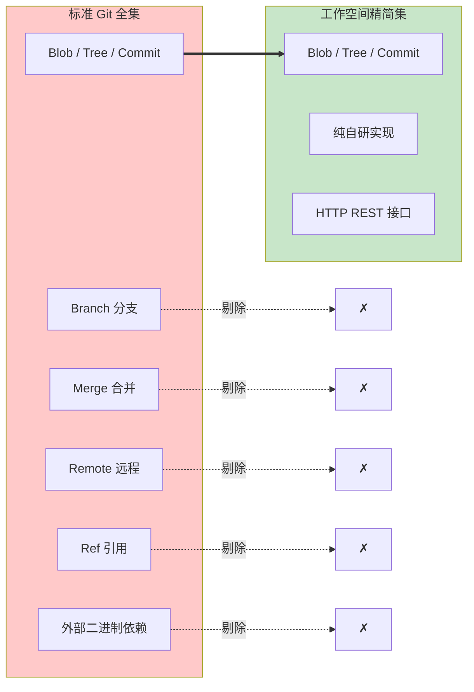

| 维度 | 标准 Git | 工作空间 |
|------|---------|---------|
| 核心对象模型 | Blob / Tree / Commit | **完整保留** |
| 分支与合并 | Branch / Merge / Rebase | 剔除 |
| 远程与引用 | Remote / Ref / Tag | 剔除 |
| 运行依赖 | 外部二进制程序（git CLI） | **纯自研，零外部依赖** |
| 通信协议 | Git 自有协议 | **HTTP REST + JSON** |
| 语言绑定 | 与 CLI 强耦合 | **跨语言兼容** |

### 1.3 核心能力聚焦

剔除冗余之后，工作空间聚焦三大核心能力：

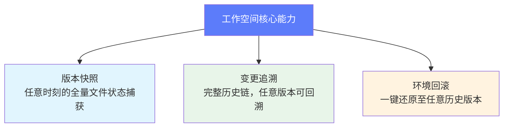

---

## 二、空间边界：业务区与系统区的强隔离

### 本章要点

| 核心设计 | 一句话说明 |
|---------|-----------|
| 双区隔离 | 业务区完全开放 + 系统区永久锁死，物理隔离、权限隔离、逻辑隔离 |
| toc.yml | 业务文件的节点层级与路径映射，纳入版本管控 |
| .workspace | 系统隐藏目录，仅内核可操作，外部无任何权限 |

### 2.1 整体目录结构

工作空间根目录为全域存储载体，根目录下仅存在两个固定项：

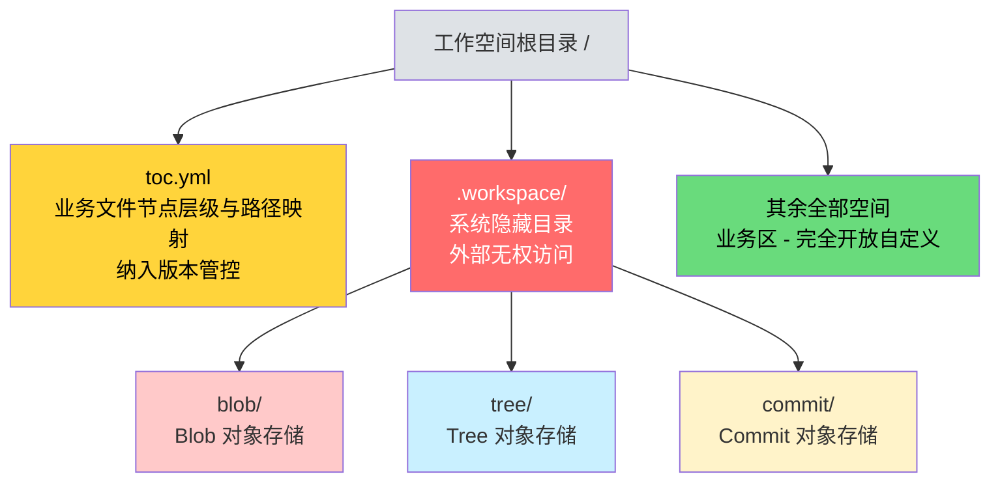

### 2.2 业务区：完全开放的自由空间

业务区占据根目录下除 `toc.yml` 和 `.workspace` 之外的全部空间，具备以下特征：

- 支持任意目录、文件的自定义创建、修改、删除
- 满足各类业务的灵活存储需求
- 所有变更均被系统内核实时感知
- 与 toc.yml 同等纳入版本管控

### 2.3 系统区：锁死的版本内核

`.workspace` 系统目录是版本化能力的核心载体，具备三重锁定：

| 锁定维度 | 说明 |
|---------|------|
| **结构锁死** | 内部仅含 blob/、tree/、commit/ 三个固定子目录，永久不可变更 |
| **权限锁定** | 外部任何程序、任何用户均无权进入修改、增删、读写 |
| **逻辑锁定** | 仅系统内核可操作，这是保障版本内核稳定的根本 |

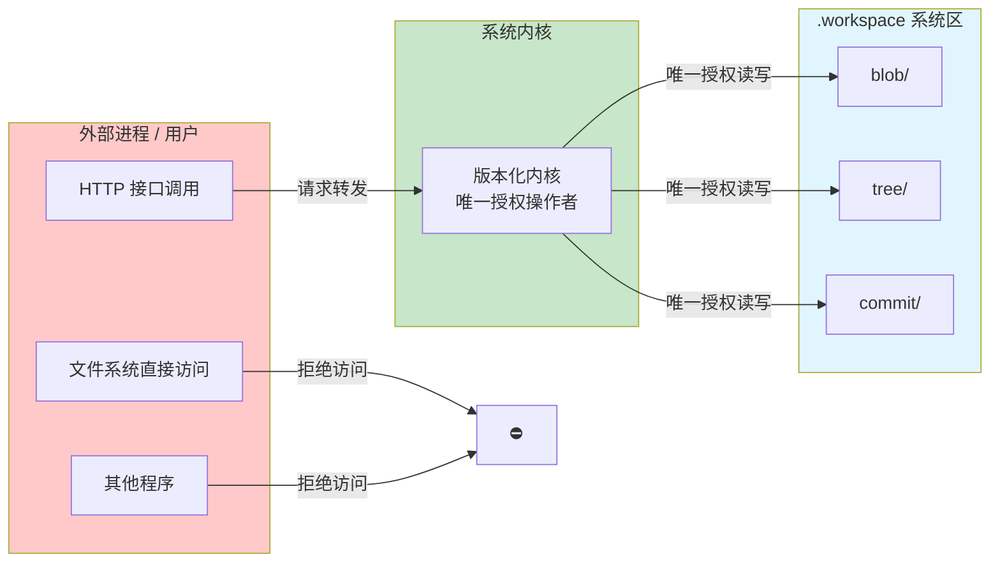

### 2.4 三重隔离机制

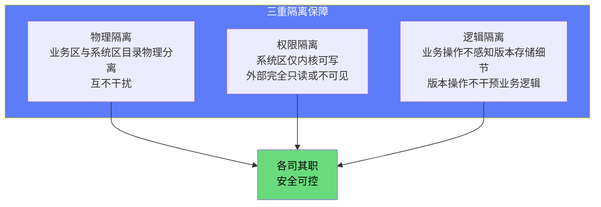

---

## 三、底层对象模型：Blob、Tree、Commit

### 本章要点

| 对象 | 职责 | 去重机制 |
|------|------|---------|
| Blob | 存储单个文件内容 | 相同内容 SHA256 相同，只存一份 |
| Tree | 记录全量目录快照 | 关联 Blob 哈希，结构可复用 |
| Commit | 链式串联变更历史 | 父提交哈希 + 当前 Tree 哈希 |

### 3.1 Blob —— 内容寻址的存储单元

Blob 对应单个文件的内容，通过 **SHA256 哈希值**作为唯一标识。

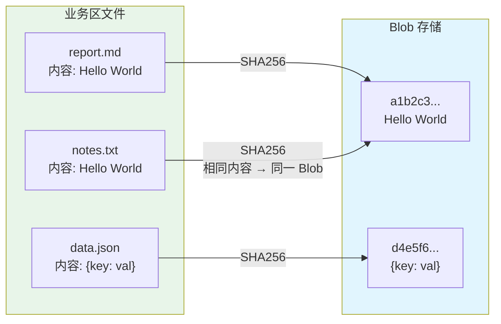

**核心优势**：相同内容的文件只存储一份，实现极致存储去重。无论业务区有多少份内容相同的文件，Blob 层始终只保留一份物理存储。

### 3.2 Tree —— 全量目录快照

Tree 对应某一时刻的全量目录快照，记录三项关键信息：

| 字段 | 说明 |
|------|------|
| 路径 | 文件在目录树中的完整路径 |
| 文件类型 | 文件 / 目录 |
| 关联 Blob 哈希 | 指向对应的内容存储 |

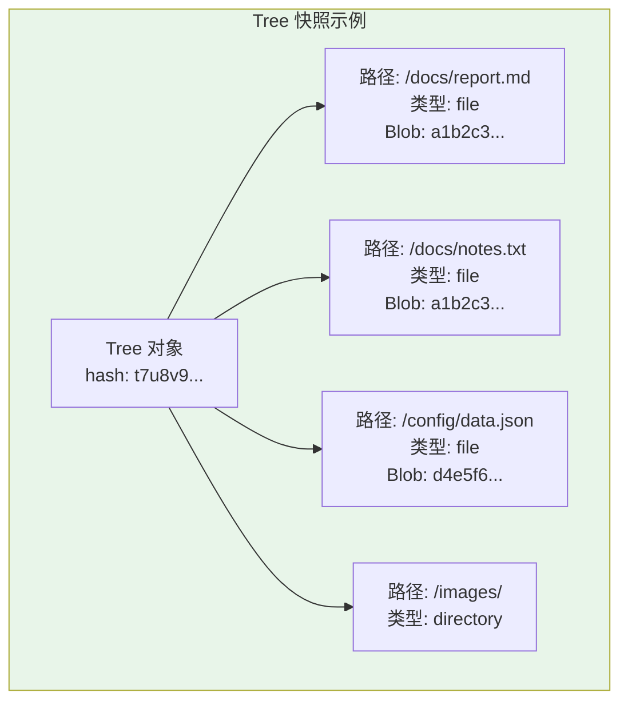

### 3.3 Commit —— 链式变更记录

Commit 对应一次完整变更提交，包含五项核心信息：

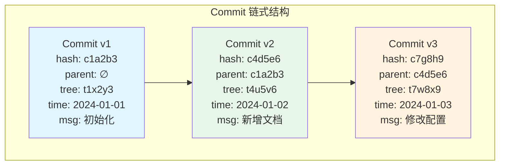

| 字段 | 说明 |
|------|------|
| 提交哈希 | 当前 Commit 的唯一标识 |
| 父提交哈希 | 指向上一次 Commit，形成链式结构 |
| 关联 Tree 哈希 | 指向本次提交时刻的目录快照 |
| 提交时间 | 变更发生的时间戳 |
| 提交说明 | 人工或自动生成的变更描述 |

### 3.4 三对象联动关系

三层对象通过哈希引用串联，形成完整的版本化数据结构：

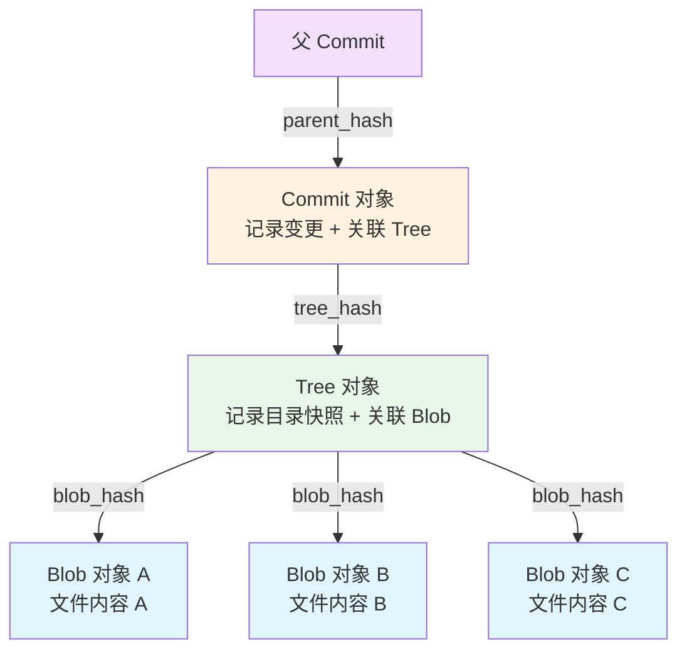

---

## 四、三层架构设计

### 本章要点

| 层级 | 职责 | 关键特征 |
|------|------|---------|
| 协议接入层 | 接收请求、参数校验、路径防穿透 | 单一入口、安全拦截 |
| 核心能力层 | 文件操作、版本提交、差异对比、环境回滚 | 全部核心逻辑 |
| 底层存储层 | Blob / Tree / Commit 持久化 | 纯对象存储、无业务逻辑 |

### 4.1 整体分层架构

系统自上而下分为三层，单向依赖，上层调用下层，下层不感知上层：

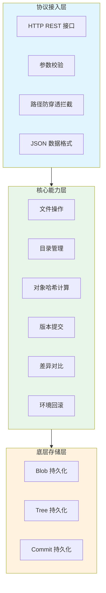

### 4.2 协议接入层

协议接入层是系统对外的唯一窗口，承担两项核心职责：

**请求接收与参数校验**：所有外部调用通过 HTTP REST 标准协议接入，统一以 JSON 作为数据交互格式，完成跨语言兼容。无论是 Java、Go、Python 还是其他开发语言，均可通过标准化接口完成全量操作。

**路径防穿透拦截**：对每个请求做严格的路径合法性校验，拒绝访问 `.workspace` 目录及外部路径，保障业务区隔离安全。

### 4.3 核心能力层

核心能力层实现系统的全部核心逻辑，包含六大能力模块：

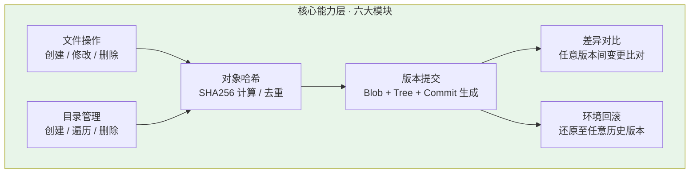

### 4.4 底层存储层

底层存储层专注于三类对象的持久化落地，不包含任何业务逻辑：

| 对象类型 | 存储路径 | 存储内容 |
|---------|---------|---------|
| Blob | `.workspace/blob/` | 文件原始内容，以哈希值命名 |
| Tree | `.workspace/tree/` | 目录快照 JSON，以哈希值命名 |
| Commit | `.workspace/commit/` | 提交元数据 JSON，以哈希值命名 |

---

## 五、文件变更与版本联动

### 本章要点

| 阶段 | 说明 |
|------|------|
| 变更捕获 | 外部操作业务区文件 / toc.yml，内核实时感知 |
| 版本提交 | 扫描全空间 → 计算 Blob 哈希 → 生成 Tree 快照 → 生成 Commit |
| 版本对比 | 对比两个 Commit 关联的 Tree 差异 |
| 环境回滚 | 基于 Tree 快照还原全空间文件状态 |

### 5.1 变更捕获机制

外部通过 HTTP 接口操作业务区文件、修改 toc.yml 时，系统内核会**实时捕获**所有变更：

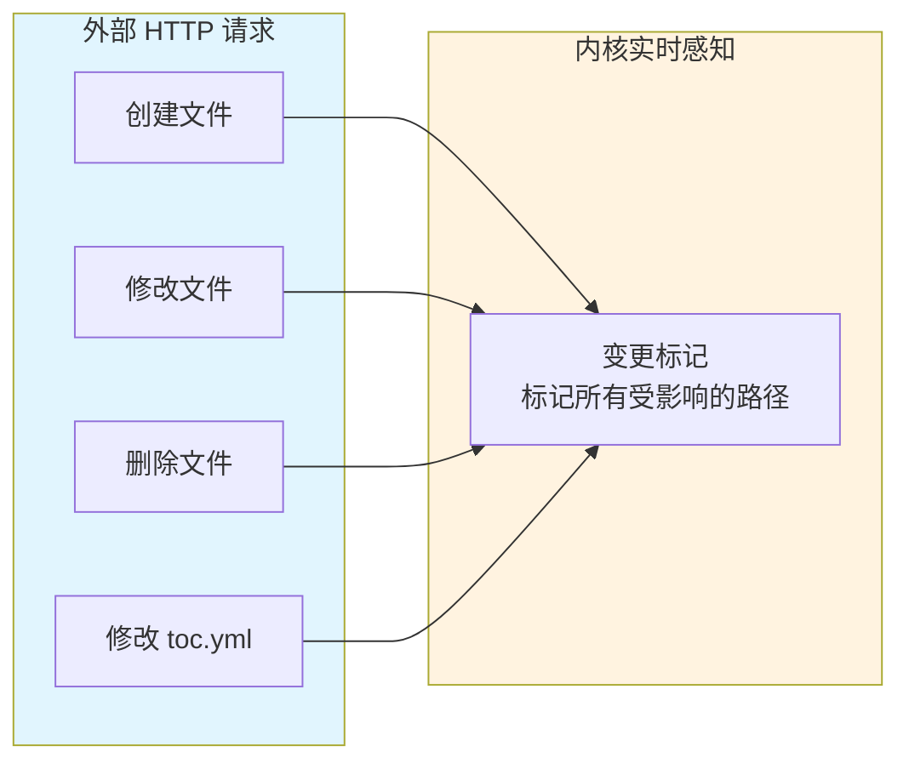

### 5.2 版本提交流程

当触发版本提交动作时，内核执行以下四步操作：

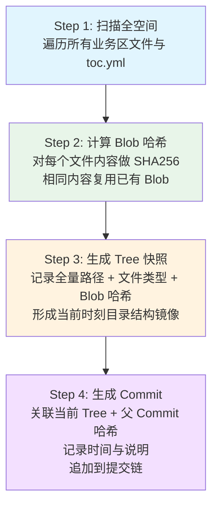

### 5.3 版本对比与环境回滚

版本提交完成后，可基于提交链进行两类核心操作：

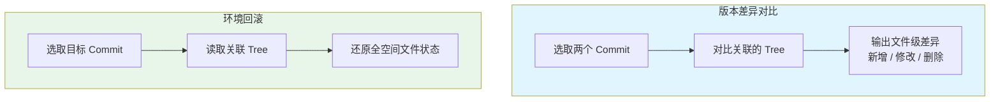

---

## 六、对外接口设计

### 本章要点

| 能力场景 | 覆盖接口 | 安全机制 |
|---------|---------|---------|
| 空间初始化 | 创建工作空间、初始化目录结构 | 权限校验 |
| 文件操作 | 创建 / 读取 / 修改 / 删除文件 | 路径防穿透 |
| 目录操作 | 创建 / 遍历 / 删除目录 | 路径防穿透 |
| toc.yml 管理 | 读取 / 修改 / 校验 | 结构合法性校验 |
| 版本控制 | 提交 / 对比 / 回滚 | 完整性校验 |

### 6.1 五大核心场景

对外接口严格遵循 REST 规范，覆盖五大核心场景：

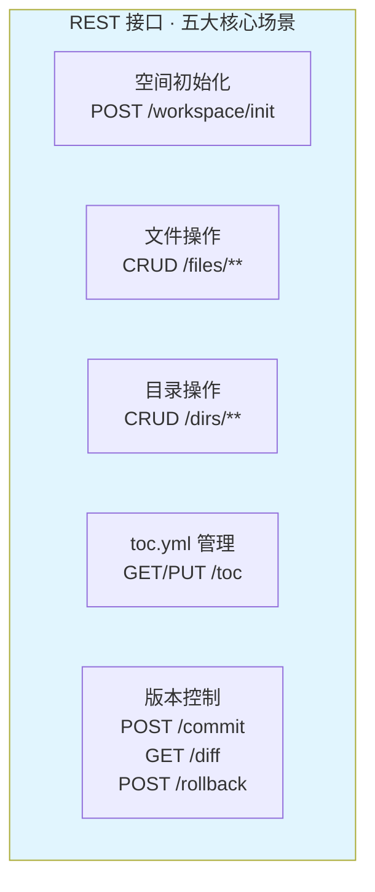

### 6.2 安全校验机制

每个接口都做严格的路径校验，拦截跨目录穿透请求：

| 校验项 | 校验规则 | 拦截目标 |
|-------|---------|---------|
| 路径穿越 | 拒绝 `../` 等相对路径跳转 | 防止访问系统区外路径 |
| 系统区保护 | 拒绝所有 `.workspace` 路径访问 | 防止外部篡改版本数据 |
| 路径合法性 | 仅允许业务区合法路径格式 | 保障业务区隔离安全 |

请求响应格式统一，错误码遵循 HTTP 标准，对接逻辑简单、清晰、无歧义。

---

## 七、安全隔离体系

### 本章要点

| 隔离层级 | 隔离方式 | 防护目标 |
|---------|---------|---------|
| 接口层 | 路径合法性校验 | 阻止跨目录穿透、系统区访问 |
| 内核层 | 读写权限锁定 | 外部进程无法篡改系统目录 |
| 存储层 | 哈希完整性校验 | 防止存储文件被恶意修改 |

### 7.1 三层安全防护

安全隔离是贯穿系统设计的底层逻辑，形成接口层、内核层、存储层三层防护体系：

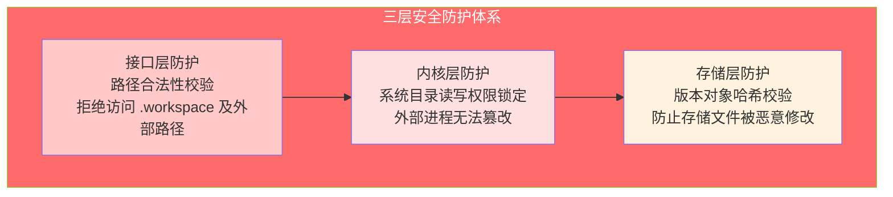

### 7.2 安全边界全景

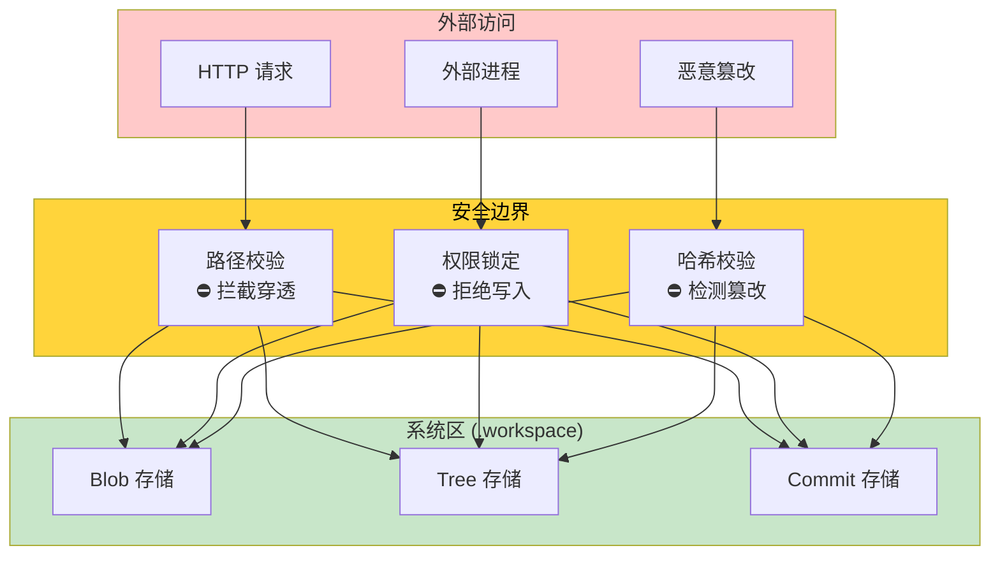

---

## 八、系统运行全流程

### 本章要点

整个系统的运行形成完整闭环：**初始化 → 业务操作 → 版本提交 → 对比回滚**。

### 8.1 全流程闭环

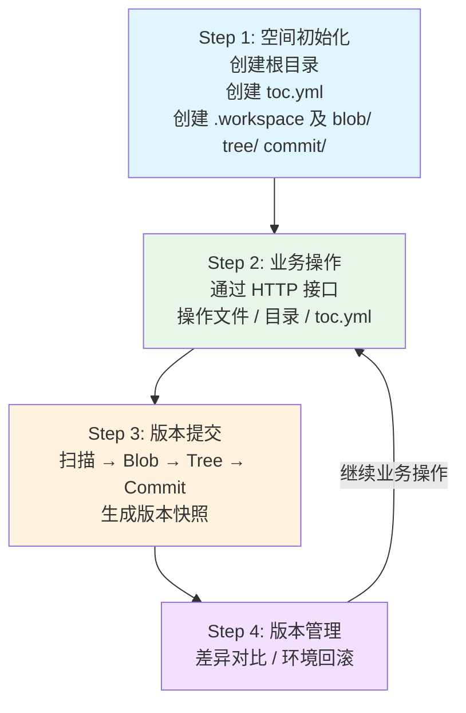

### 8.2 完整数据流

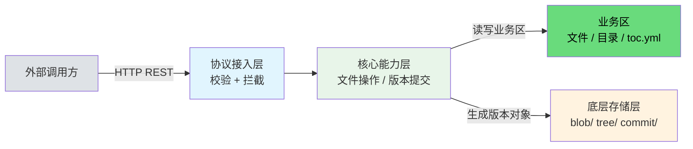

---

## 总结：工作空间全景图

```mermaid
flowchart TB
    L1["设计哲学<br/>取 Git 精华 · 去 Git 冗余 · 纯自研实现"]
    L2["空间边界<br/>业务区开放自由 · 系统区三重锁定"]
    L3["对象模型<br/>Blob 内容去重 · Tree 目录快照 · Commit 链式历史"]
    L4["三层架构<br/>协议接入层 · 核心能力层 · 底层存储层"]
    L5["版本联动<br/>变更捕获 → Blob → Tree → Commit → 对比/回滚"]
    L6["安全隔离<br/>接口层 · 内核层 · 存储层 三层防护"]

    L1 --> L2 --> L3 --> L4 --> L5 --> L6

    style L1 fill:#e1f5fe
    style L2 fill:#e8f5e9
    style L3 fill:#fff3e0
    style L4 fill:#fce4ec
    style L5 fill:#f3e0ff
    style L6 fill:#ffecce
```

这套设计的本质，是**取 Git 内核之精华，去拓展能力之冗余**，以极简、可控、通用的方式，实现一套**轻量级、高隔离、跨语言**的版本化文件系统。整个系统从空间边界、对象模型、架构分层、版本联动到安全隔离，每一环都围绕"极简内核 + 强边界隔离"这一核心理念展开，在沙箱环境中提供稳定、安全、可追溯的文件版本化服务。

---

> **核心特质**：极简对象内核 + 强边界隔离 + 跨语言 REST 通信 + 完整版本闭环
