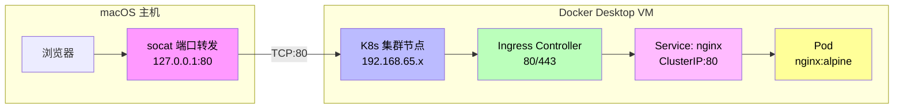
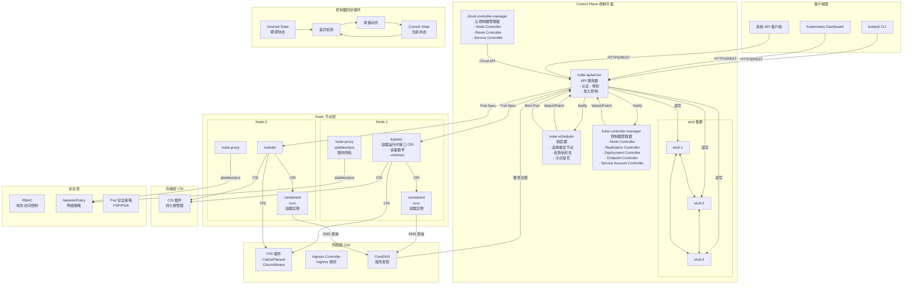
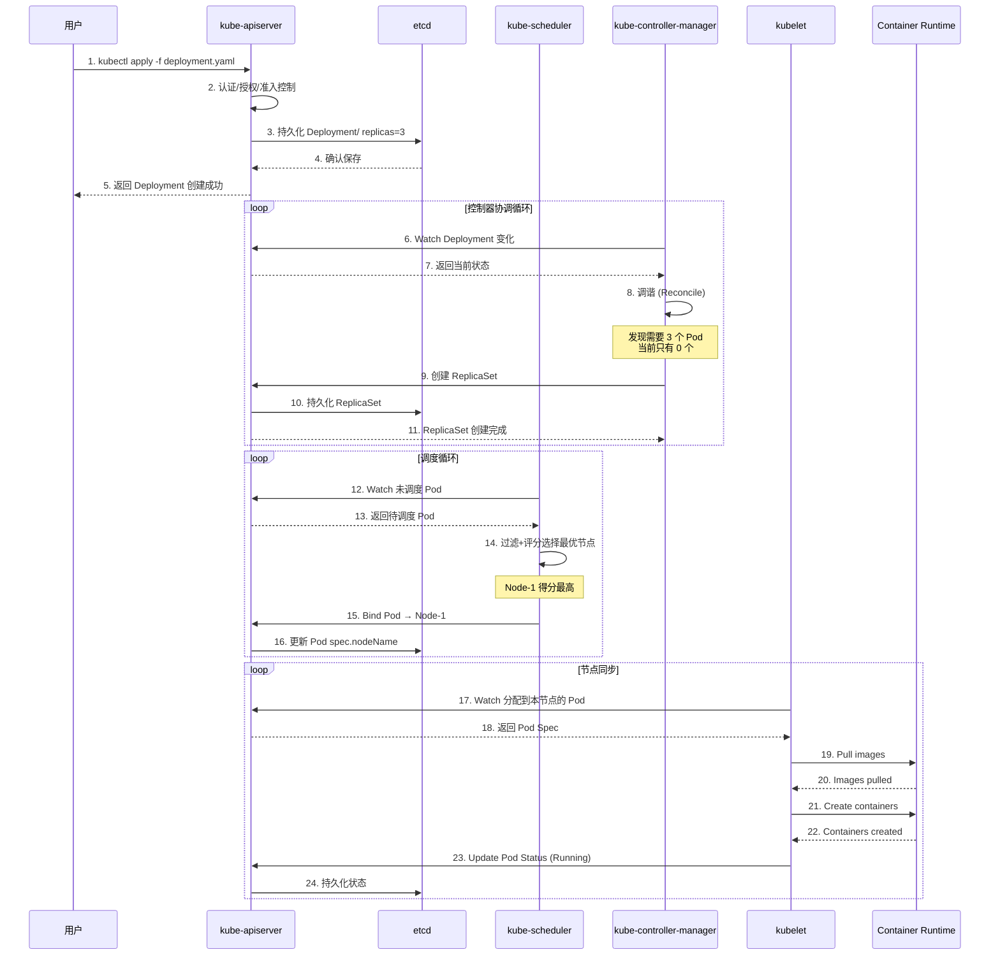
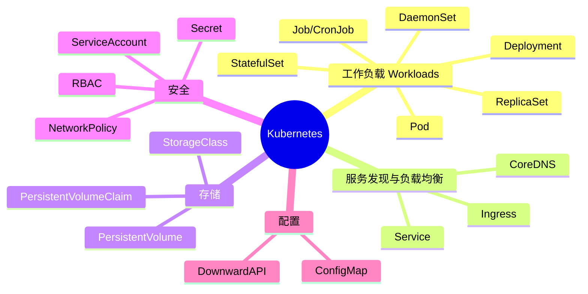
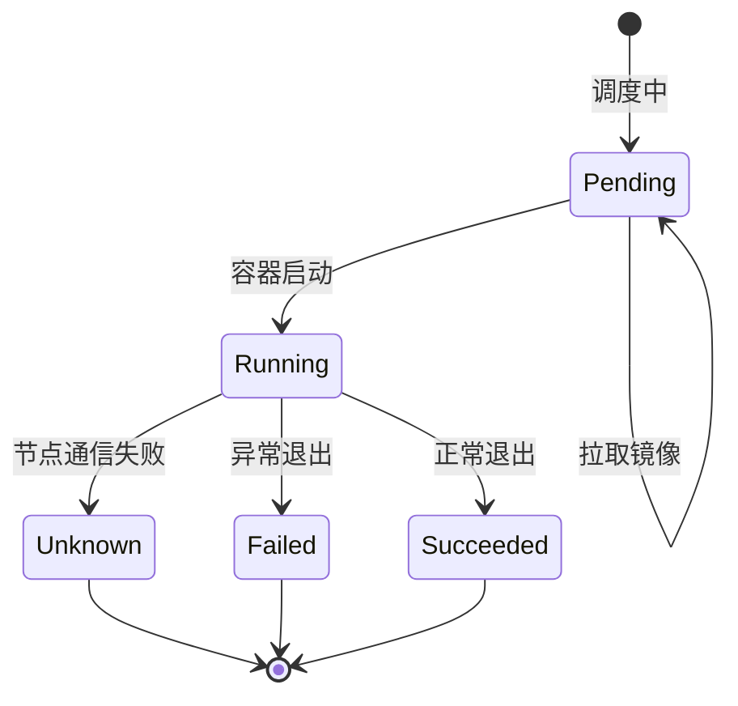
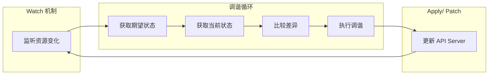
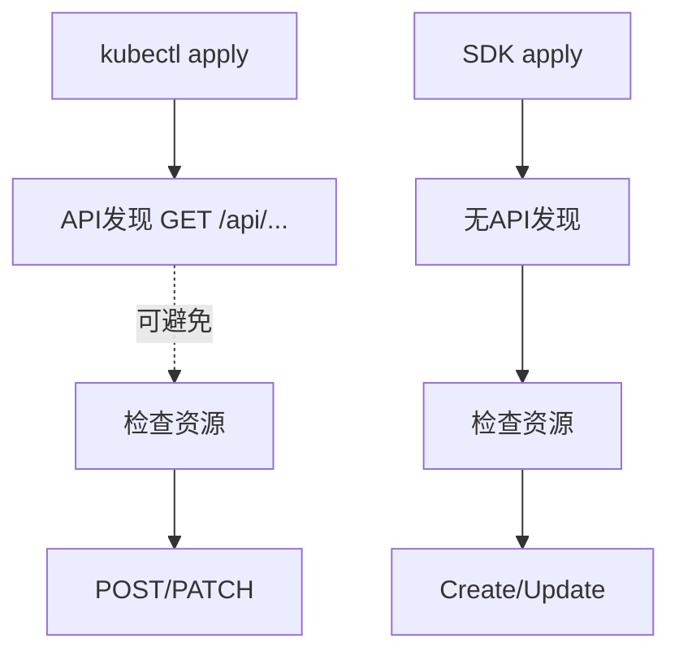
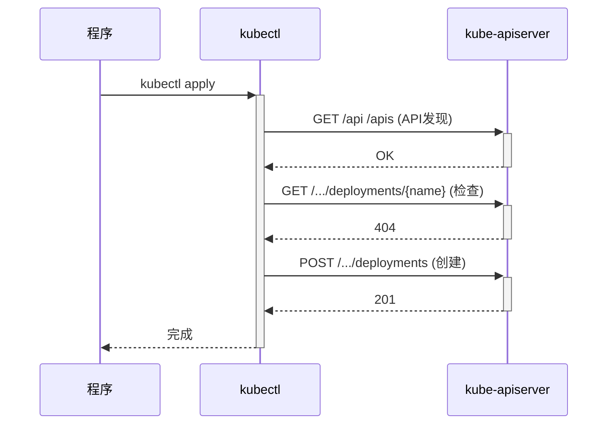
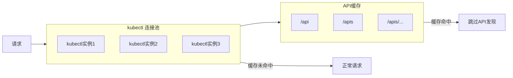

# Kubernetes 实践避坑指南

> **阅读对象**:后端工程师、平台工程师、SRE、Kubernetes 初学者
> **前置阅读**:[OpenCode K8S 集群部署指南](../0xD0_实践指南/OpenCodeK8S集群部署指南.md)

本文合并 Kubernetes 本地开发环境、底层工作原理、kubectl 执行流程三部分内容,用于帮助团队理解 K8S 常见问题背后的运行机制。

## 目录
- [1. Docker Desktop Kubernetes 本地开发环境](#1-docker-desktop-kubernetes-本地开发环境)
- [2. Kubernetes 底层工作原理](#2-kubernetes-底层工作原理)
- [3. kubectl apply 执行流程](#3-kubectl-apply-执行流程)

## 1. Docker Desktop Kubernetes 本地开发环境



## 环境要求

- Docker Desktop 4.51+
- macOS

## 1. 启用 Kubernetes

1. Docker Desktop → Settings → Kubernetes
2. 选择 **Kubeadm**（单节点）或 **Kind**（多节点）
3. 点击 **Create**
4. 等待创建完成

```bash
# 验证
kubectl get nodes
```

## 2. 部署 Ingress（hostNetwork + hostPort）

```bash
# 添加 helm 源
helm repo add ingress-nginx https://kubernetes.github.io/ingress-nginx
helm repo update

# 安装 ingress
helm install ingress-nginx ingress-nginx/ingress-nginx \
  --namespace ingress \
  --create-namespace \
  --set controller.hostNetwork=true \
  --set controller.hostPort.enabled=true \
  --set controller.hostPort.http=80 \
  --set controller.hostPort.https=443

# 等待就绪
kubectl wait --for=condition=ready pod -l app.kubernetes.io/component=controller -n ingress --timeout=60s
```

## 3. 配置端口转发（socat）

Docker Desktop 的 K8s 运行在虚拟机内，macOS 无法直接访问节点 IP。需要用 socat 做端口转发。

### 方案：Docker 容器运行 socat

```bash
# 获取 K8s 节点 IP
kubectl get nodes -o jsonpath='{.items[0].status.addresses[?(@.type=="InternalIP")].address}'
# 输出：192.168.65.3

# 启动 socat 容器
docker run -d \
  --name socat \
  --restart=always \
  -p 80:80 \
  socat TCP-LISTEN:80,fork TCP:192.168.65.3:80
```

**访问链路**：
```
浏览器 → 127.0.0.1:80 → socat → K8s节点:80 → Ingress
```

### 停止和卸载

```bash
docker stop socat && docker rm socat
```

## 4. 部署示例服务

### 创建 Namespace

```bash
kubectl create namespace demo
```

### 部署 Nginx

```yaml
apiVersion: v1
kind: Service
metadata:
  name: nginx
  namespace: demo
spec:
  selector:
    app: nginx
  ports:
    - port: 80
      targetPort: 80
  type: ClusterIP
---
apiVersion: apps/v1
kind: Deployment
metadata:
  name: nginx
  namespace: demo
spec:
  replicas: 1
  selector:
    matchLabels:
      app: nginx
  template:
    metadata:
      labels:
        app: nginx
    spec:
      containers:
        - name: nginx
          image: nginx:alpine
          ports:
            - containerPort: 80
```

```bash
kubectl apply -f nginx.yaml
```

### 创建 Ingress

```yaml
apiVersion: networking.k8s.io/v1
kind: Ingress
metadata:
  name: nginx
  namespace: demo
  annotations:
    nginx.ingress.kubernetes.io/rewrite-target: /
spec:
  ingressClassName: nginx
  rules:
    - host: nginx.local
      http:
        paths:
          - path: /
            pathType: Prefix
            backend:
              service:
                name: nginx
                port:
                  number: 80
```

```bash
kubectl apply -f nginx-ingress.yaml
```

### 配置 hosts（可选）

```bash
echo "127.0.0.1 nginx.local" | sudo tee -a /etc/hosts
```

### 访问

```
http://nginx.local
```

## 5. 常用命令

```bash
# 查看所有 Pod
kubectl get pods -A

# 查看 Ingress
kubectl get ingress -A

# 查看日志
kubectl logs -n ingress -l app.kubernetes.io/component=controller --tail=50

# 删除所有资源
kubectl delete namespace demo
helm uninstall ingress-nginx -n ingress
```

## 6. 常见问题

### Q: socat 端口被占用

```bash
# 查看谁占用 80 端口
lsof -i :80

# 停止占用进程或修改 socat 端口
docker stop <进程名>
```

### Q: Ingress 返回 404

检查 Ingress 是否配置正确，确认有对应的 Service。

```bash
kubectl describe ingress nginx -n demo
```

### Q: 需要重启 K8s

Docker Desktop → Settings → Kubernetes → Reset Kubernetes Cluster

重置后需要重新部署 Ingress 和 socat。

---

## 2. Kubernetes 底层工作原理

## 架构总览



## 核心工作流程



## 关键组件职责

| 组件 | 职责 | 关键词 |
|------|------|--------|
| **kube-apiserver** | 唯一入口 | REST API, etcd 交互 |
| **etcd** | 分布式存储 | Raft 协议, 一致性 |
| **kube-scheduler** | Pod 调度 | 过滤, 评分, 亲和性 |
| **kubelet** | 节点代理 | CRI, CSI, CNI |
| **kube-proxy** | 服务网络 | iptables/ipvs |
| **kube-controller-manager** | 控制器集合 | 调谐循环, 期望状态 |

## 核心概念



## Pod 生命周期



## 控制器协调模式



---

## 3. kubectl apply 执行流程





## 三阶段

| 阶段 | 请求 | 说明 |
|-----|------|------|
| API发现 | GET /api /apis ... | kubectl启动时自动探测 |
| 检查资源 | GET /.../deployments/{name} | 判断创建还是更新 |
| 执行操作 | POST/PATCH | 真正创建或更新资源 |

---

# 优化方案

## 方案一：kubectl 连接池 + 缓存

### 原理



### 实现方式

```javascript
class KubectlPool {
    constructor(poolSize = 5) {
        this.pool = [];
        this.cache = new Map();
        this.init(poolSize);
    }

    async init(size) {
        for (let i = 0; i < size; i++) {
            const proc = spawn('kubectl', ['get', 'api'], { /* 配置 */ });
            this.pool.push(proc);
        }
        // 预热缓存
        await this.warmupCache();
    }

    async warmupCache() {
        // 首次调用时缓存 API 发现结果
        const result = await this.exec('kubectl get api -o json');
        this.cache.set('api_discovery', result);
    }

    async apply(yaml) {
        // 使用缓存中的 API 信息
        const cachedApi = this.cache.get('api_discovery');
        if (cachedApi) {
            // 复用连接，复用缓存
            return await this.execWithPool('kubectl apply -f -', yaml);
        }
    }
}
```

### 缓存策略

| 缓存内容 | 过期时间 | 说明 |
|---------|---------|------|
| /api | 1小时 | 核心API变化少 |
| /apis | 1小时 | 扩展API变化少 |
| API响应 | 30分钟 | 具体资源响应 |

### 效果

```
优化前: 每次 apply 50条 GET (API发现)
优化后: 首次 50条 GET，后续 0条 GET (使用缓存)

请求减少: ~90%
```

---

## 方案二：Node.js SDK (@kubernetes/client-node)

### 优势

| | kubectl | SDK |
|--|---------|-----|
| API发现 | 必须 (10-50条) | 无需 |
| 依赖 | 需安装kubectl | 纯JS库 |
| 性能 | 每次发现API | 直接调用 |
| 控制粒度 | 低 | 高 |

### 安装

```bash
npm install @kubernetes/client-node
```

### 完整示例

```javascript
const k8s = require('@kubernetes/client-node');

// 初始化配置
const kc = new k8s.KubeConfig();
kc.loadFromCluster();

// 创建 API 客户端
const appsApi = kc.makeApiClient(k8s.AppsV1Api);
const coreApi = kc.makeApiClient(k8s.CoreV1Api);
const networkingApi = kc.makeApiClient(k8s.NetworkingV1Api);

// Deployment 对象
const deployment = {
    apiVersion: 'apps/v1',
    kind: 'Deployment',
    metadata: { name: 'my-app', namespace: 'default' },
    spec: {
        replicas: 3,
        selector: { matchLabels: { app: 'my-app' } },
        template: { /* ... */ }
    }
};

// Service 对象
const service = {
    apiVersion: 'v1',
    kind: 'Service',
    metadata: { name: 'my-service', namespace: 'default' },
    spec: {
        selector: { app: 'my-app' },
        ports: [{ port: 80, targetPort: 8080 }]
    }
};

// Ingress 对象
const ingress = {
    apiVersion: 'networking.k8s.io/v1',
    kind: 'Ingress',
    metadata: { name: 'my-ingress', namespace: 'default' },
    spec: {
        rules: [{ host: 'example.com', http: { paths: [] } }]
    }
};

// 创建资源
async function createResources() {
    try {
        // 创建 Deployment
        await appsApi.createNamespacedDeployment('default', deployment);
        
        // 创建 Service
        await coreApi.createNamespacedService('default', service);
        
        // 创建 Ingress
        await networkingApi.createNamespacedIngress('default', ingress);
        
        console.log('资源创建成功');
    } catch (err) {
        console.error('创建失败:', err.body);
    }
}

createResources();
```

### apply 语义实现（创建或更新）

```javascript
async function applyDeployment(deployment) {
    const name = deployment.metadata.name;
    const ns = deployment.metadata.namespace;
    
    try {
        // 尝试更新
        await appsApi.patchNamespacedDeployment(
            name, ns,
            deployment,
            undefined, undefined, undefined,
            undefined, undefined,
            { headers: { 'Content-Type': 'application/apply-patch+yaml' } }
        );
    } catch (err) {
        if (err.response && err.response.statusCode === 404) {
            // 不存在则创建
            await appsApi.createNamespacedDeployment(ns, deployment);
        } else {
            throw err;
        }
    }
}
```

---

## 方案对比

| 指标 | kubectl连接池 | SDK |
|-----|-------------|-----|
| API发现请求 | 首次后为0 | 始终为0 |
| 实现复杂度 | 中 | 低 |
| 代码改动 | 中 | 大 |
| 依赖 | kubectl | @kubernetes/client-node |
| 请求减少 | ~90% | ~90% |

---

## 推荐

**小型项目/快速迭代**：方案一 (kubectl连接池，改动小)

**大型项目/长期维护**：方案二 (SDK，性能最优)
