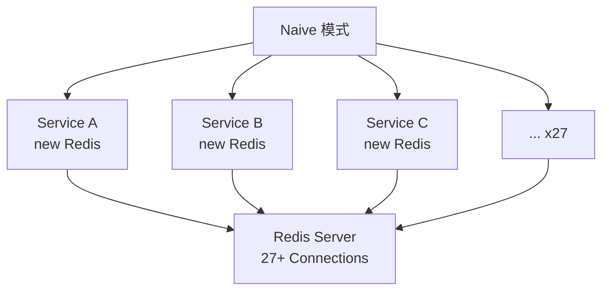
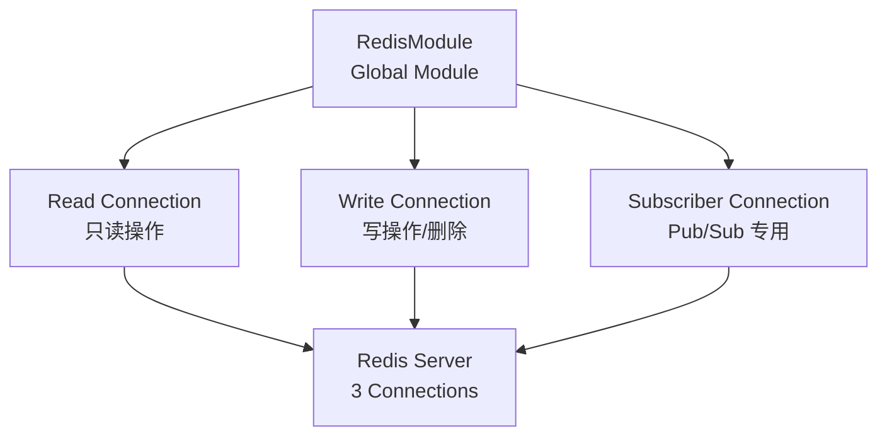
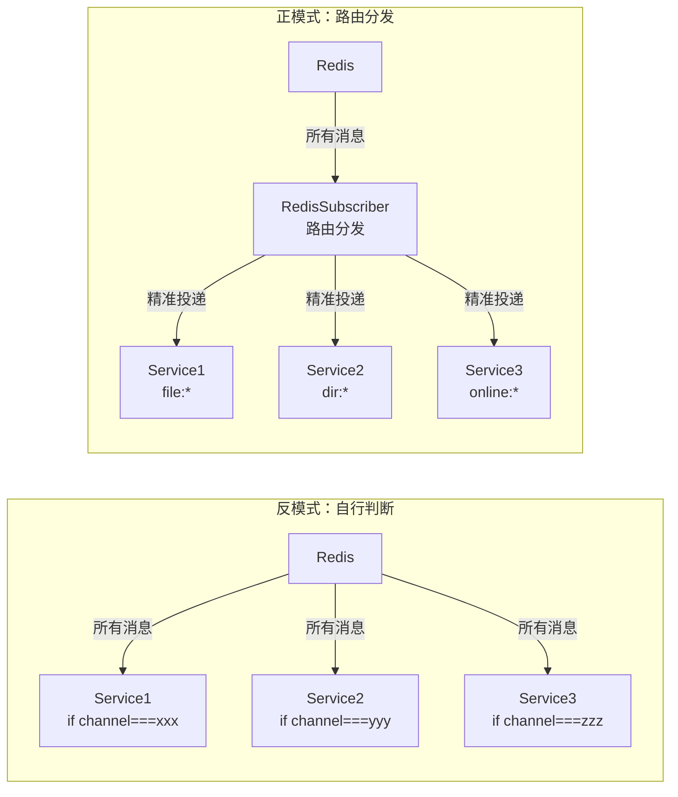
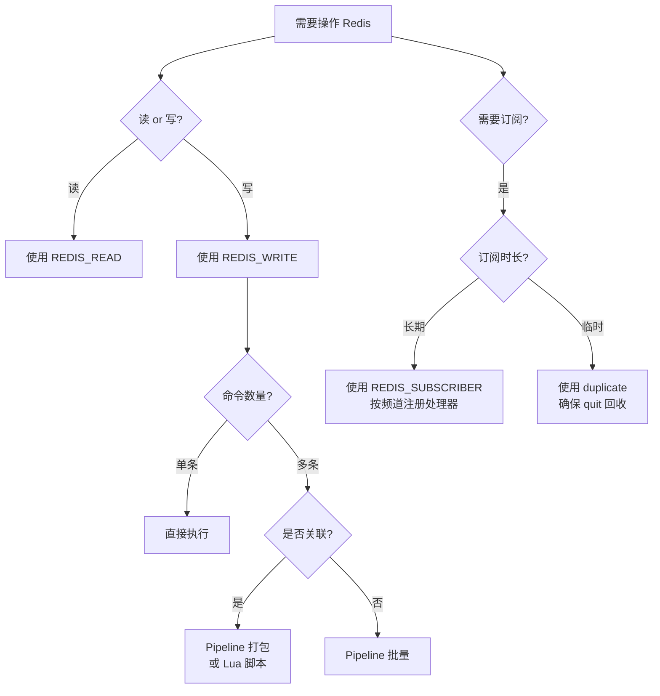

# 生产故障排查九讲
> **阅读对象**:SRE、平台工程师、后端工程师、技术负责人
> **前置阅读**:[OpenCode K8S 集群部署指南](../0xD0_实践指南/OpenCodeK8S集群部署指南.md)

这是一组从生产问题中沉淀出的排障与优化复盘,覆盖 QPS 波动、磁盘 IO、心跳服务、PVC、Pod 检测、监控事件、慢 SQL、调度辅助与 Redis 性能优化。

## 目录
- [1. QPS异常波动与API调用优化](#1-qps异常波动与api调用优化)
- [2. 磁盘IO高与调度负载失衡](#2-磁盘io高与调度负载失衡)
- [3. 心跳服务分布式改造](#3-心跳服务分布式改造)
- [4. PVC挂载优化](#4-pvc挂载优化)
- [5. Pod状态检测与容器安全](#5-pod状态检测与容器安全)
- [6. 监控与事件分发优化](#6-监控与事件分发优化)
- [7. 数据库慢SQL优化](#7-数据库慢sql优化)
- [8. 调度辅助功能修复](#8-调度辅助功能修复)
- [9. Redis性能优化](#9-redis性能优化)

## 1. QPS 异常波动与 API 调用优化

## 1. 问题概述

### 1.1 问题现象
会议期间 QPS 出现偶发性异常波动，短暂飙升至 **百万至千万级别**，随后回落至正常范围（约 200 QPS）。

### 1.2 影响范围
- 激增流量主要为来自 PTY 组件的高频 GET 请求（健康检查/列表查询）
- 响应耗时均为毫秒级
- 未造成持续性阻塞

---

## 2. 根因分析

### 2.1 问题定位
创建/销毁容器采用 `spawn/exec` 隔离子进程方式执行 `kubectl` 指令。每次新进程启动时均会触发全量 API Discovery 预热流程：

| 步骤 | 调用的 API |
|------|------------|
| 1 | 查 `/api` 获取 core 组信息 |
| 2 | 查 `/apis` 获取所有 API Group 列表 |
| 3 | 遍历查询每个 group 的 versions 与 resources |
| 4 | 拉取 OpenAPI 规格用于校验与补全 |

### 2.2 核心问题
虽然 `kubectl` 默认启用本地缓存（`~/.kube/cache`），但由于 `spawn/exec` 创建的是**全新独立子进程**，**进程隔离导致缓存无法共享**。

### 2.3 问题本质
在并发批量调用场景下，每个子进程独立执行一遍全量预热，导致 APIServer 请求瞬时堆积，QPS 飙升。

---

## 3. 解决方案

### 3.1 API 客户端实例缓存
- **方案**：将 API 客户端实例提升为类级别静态属性
- **时机**：在类初始化阶段统一创建并缓存
- **效果**：后续调用复用同一实例，彻底消除重复的 API Discovery 开销
- **成果**：单次调用额外请求从**数百次降为零**

**相关提交**：`4536279`, `d3257f9`

### 3.2 官方 SDK 替代 kubectl
- **方案**：引入 `@kubernetes/client-node` 官方 SDK 直接与 Kubernetes API Server 通信
- **替代**：不再使用 shell 子进程调用 kubectl
- **实现功能**：
  - `apply`（基于 Server-Side Apply 语义）
  - `deleteByLabel`（按标签批量删除）
- **收益**：
  - 消除进程启动开销与环境依赖
  - 异常处理链路更精细

**相关提交**：`4536279`, `df14274`

---

## 4. 效果验证

| 指标 | 优化前 | 优化后 |
|------|--------|--------|
| 单次调用额外 API 请求 | 数百次 | 0 |
| API Discovery 开销 | 每次调用均触发 | 仅首次初始化 |
| 进程启动开销 | 每次调用均创建新进程 | 无 |

---

## 5. 经验教训

### 5.1 技术要点
1. **进程隔离影响**：子进程无法共享父进程缓存，需特别注意
2. **SDK vs CLI**：优先使用 SDK 而非 CLI 调用，减少进程开销
3. **单例模式**：客户端实例应设计为单例或连接池模式

### 5.2 监控建议
- 监控 APIServer QPS 异常波动
- 关注每次请求的额外 API 调用开销

---

## 6. 参考提交

| 提交 | 描述 |
|------|------|
| `4536279` | API 客户端缓存实现 |
| `d3257f9` | 客户端实例优化 |
| `df14274` | 官方 SDK 集成 |

---

## 2. 磁盘 IO 高与调度负载失衡

## 1. 问题概述

### 1.1 磁盘 IO 偏高
**现象**：VS Code 容器启动时出现短暂的磁盘写入高峰，随后迅速回落至 100 以下。

**根因定位**：通过 `iotop` 确认写入来源为 VS Code 进程，属正常业务行为。

**结论**：无持续性瓶颈，无需优化。

### 1.2 调度负载失衡
**现象**：
- 新扩容的 **10 台节点**长期未被分配任务，资源利用率极低
- 旧节点持续承载高负载（最高达 **43%**）
- 整体节点使用率未超 30%，但存在明显调度不均

**风险**：
- 资源利用率不均
- 潜在单点风险（旧节点过载）

---

## 2. 问题对比

| 问题类型 | 严重程度 | 当前状态 | 后续动作 |
|----------|----------|----------|----------|
| 磁盘 IO 偏高 | 低 | 确认为正常业务行为 | 无需处理 |
| 调度负载失衡 | 中 | 待优化 | 调整节点亲和性或调度策略 |

---

## 3. 调度问题分析

### 3.1 可能原因
1. **调度器配置问题**：新节点可能未满足调度条件
2. **亲和性规则**：可能存在阻止新节点被使用的亲和性/反亲和性规则
3. **资源标签**：新节点可能缺少必要的标签或污点

### 3.2 优化方向
- 检查节点亲和性配置
- 调整调度器策略
- 均衡新/旧节点负载分配

---

## 4. 监控建议

| 监控项 | 阈值 | 告警条件 |
|--------|------|----------|
| 磁盘 IO | 100 | 持续高于阈值 |
| 节点 CPU 使用率 | 30% | 旧节点高于 40% |
| 节点任务分布 | - | 新节点利用率低于 5% |

---

## 5. 后续行动计划

| 优先级 | 任务 | 负责人 | 状态 |
|--------|------|--------|------|
| P1 | 检查调度器亲和性配置 | - | 待处理 |
| P1 | 验证新节点标签配置 | - | 待处理 |
| P2 | 优化调度策略实现负载均衡 | - | 待处理 |

---

## 3. 心跳服务分布式改造

## 1. 优化背景

原心跳服务存在以下问题：
- WebSocket 心跳频繁 PATCH kube-apiserver，造成 API 压力
- 内存 Map 实现不支持多实例共享
- 循环内调用 `getServiceByLabel` 导致 N+1 查询

---

## 2. 问题与解决方案

### 2.1 API 压力问题

| 问题 | 解决方案 | 提交 |
|------|----------|------|
| WebSocket 心跳频繁 PATCH kube-apiserver | 引入 `HeartbeatService`，将分散的 PATCH 聚合为 **15s 间隔**的批量 flush | `0128954` |

**优化效果**：
- 减少 APIServer 请求次数
- 降低网络开销

### 2.2 多实例共享问题

| 问题 | 解决方案 | 提交 |
|------|----------|------|
| 内存 Map 实现不支持多实例共享 | 底层改为 **Redis ZSET + SETNX 分布式锁**，断连 30s 自动清理 stale 数据 | `d65b41b` |

**技术实现**：
- **ZSET**：按时间戳排序存储心跳数据，支持范围查询
- **SETNX**：分布式锁保证并发安全
- **TTL 30s**：自动清理断连节点数据

### 2.3 N+1 查询问题

| 问题 | 解决方案 | 提交 |
|------|----------|------|
| 循环内调用 `getServiceByLabel` 导致 N+1 查询 | 将查询移出循环，**批量获取后匹配** | `f7ef81a` |

**优化效果**：
- 减少数据库/API 查询次数
- 从 N 次降为 1 次

---

## 3. 架构图

```
┌─────────────────────────────────────────────────────────────┐
│                     HeartbeatService                         │
├─────────────────────────────────────────────────────────────┤
│  ┌─────────────┐    ┌─────────────┐    ┌─────────────────┐  │
│  │  Collector  │───▶│   Buffer    │───▶│ 15s Batch Flush │  │
│  │  (接收心跳) │    │  (聚合缓冲) │    │  (批量 PATCH)   │  │
│  └─────────────┘    └─────────────┘    └─────────────────┘  │
├─────────────────────────────────────────────────────────────┤
│                        Data Layer                            │
│  ┌─────────────────────────────────────────────────────┐    │
│  │  Redis ZSET (时间戳排序) + SETNX (分布式锁)         │    │
│  │  - 心跳数据存储                                      │    │
│  │  - 分布式协调                                        │    │
│  │  - 30s TTL 自动清理                                  │    │
│  └─────────────────────────────────────────────────────┘    │
└─────────────────────────────────────────────────────────────┘
```

---

## 4. 提交记录

| 提交 | 描述 |
|------|------|
| `0128954` | 心跳服务聚合与批量 flush |
| `d65b41b` | Redis ZSET + SETNX 分布式实现 |
| `f7ef81a` | 批量查询优化，消除 N+1 |

---

## 5. 经验总结

| 经验点 | 说明 |
|--------|------|
| 批量聚合 | 高频小请求应聚合为批量操作 |
| 分布式存储 | 多实例环境避免使用内存 Map |
| 查询优化 | 批量查询优于循环内单次查询 |

---

## 4. PVC 挂载优化

## 1. 问题背景

### 1.1 原问题
多 subPath 挂载导致每个子卷独立 kernel mount，耗尽节点 mount table。

### 1.2 影响
- 节点挂载表耗尽风险
- 挂载操作性能下降
- 运维复杂度增加

---

## 2. 解决方案

### 2.1 优化方案

| 优化项 | 优化前 | 优化后 |
|--------|--------|--------|
| 挂载方式 | N 个子卷独立 mount | 单 mount + symlink |
| 挂载点数 | N 个 | 1 个 |
| 路径映射 | 物理隔离 | init command 创建软链接 |

### 2.2 实现原理

```
优化前：
  /host/mnt/volume1  →  mount
  /host/mnt/volume2  →  mount
  /host/mnt/volume3  →  mount
  ... (N 个挂载点)

优化后：
  /host/mnt/storage  →  mount (1 个)
    ├── volume1  →  symlink →  /host/mnt/storage/volume1
    ├── volume2  →  symlink →  /host/mnt/storage/volume2
    └── volume3  →  symlink →  /host/mnt/storage/volume3
```

### 2.3 Init Command 示例
```yaml
initContainers:
  - name: init-storage
    command:
      - /bin/sh
      - -c
      - |
        mkdir -p /usr/local/.storage/course
        for i in {1..N}; do
          ln -sf /host/path/volume$i /usr/local/.storage/course/volume$i
        done
```

---

## 3. 存储路径规范

| 优化项 | 优化前 | 优化后 |
|--------|--------|--------|
| 存储路径 | 不规范 | `/usr/local/.storage/course` |

---

## 4. 提交记录

| 提交 | 描述 |
|------|------|
| `9ec90e0` | 单 mount + symlink 方式实现 |
| `48db9ae` | 统一存储路径规范 |

---

## 5. 优化效果

| 指标 | 优化前 | 优化后 |
|------|--------|--------|
| 挂载点数 | N 个 | 1 个 |
| mount table 占用 | N 条 | 1 条 |
| 运维复杂度 | 高 | 低 |

---

## 6. 注意事项

1. **软链接路径**：确保目标路径存在
2. **权限问题**：init container 需要足够权限创建 symlink
3. **容器兼容性**：部分基础镜像不支持 symlink

---

## 5. Pod 状态检测与容器安全

## 一、Pod 状态检测修复

### 1.1 问题描述
**Terminating 状态 Pod 被误报为 Running**

### 1.2 问题原因
原代码仅根据 Pod 的 `status.phase` 判断状态，未考虑 `deletionTimestamp` 字段。

### 1.3 解决方案
`listPodByLabel` 增加 `deletionTimestamp` 检测，准确识别终止中状态。

```javascript
// 修复前
const isRunning = pod.status.phase === 'Running';

// 修复后
const isRunning = pod.status.phase === 'Running' && !pod.metadata.deletionTimestamp;
```

**相关提交**：`ba319fe`

---

## 二、容器安全与命令注入优化

### 2.1 securityContext 配置

| 问题 | 解决方案 | 提交 |
|------|----------|------|
| 容器缺少 securityContext 配置 | 补充 `runAsUser:0` 和 `allowPrivilegeEscalation` 配置 | `c1d4477`, `289172a`, `e36cadd` |
| `allowPrivilegeEscalation` 位置错误 | 移至 **container-level** securityContext | `289172a` |

**配置示例**：
```yaml
securityContext:
  runAsUser: 0
  allowPrivilegeEscalation: false  # 必须放在 container 层级
```

### 2.2 命令注入逻辑修复

| 问题 | 解决方案 | 提交 |
|------|----------|------|
| `injectSymlinkCommand` 分支逻辑错误 | 修正分支条件判断 | `b550dd7` |
| 无 command 容器丢失 ENTRYPOINT | 改用 **postStart hook** 保留原始 ENTRYPOINT | `ae977da` |
| 命令注入方式不统一 | 统一为**单 postStart 方式** | `af0f9fe` |

**postStart Hook 示例**：
```yaml
lifecycle:
  postStart:
    exec:
      command:
        - /bin/sh
        - -c
        - |
          # 执行注入命令
          echo "command injected"
```

---

## 三、提交汇总

| 提交 | 修复内容 |
|------|----------|
| `ba319fe` | Pod 状态检测 - deletionTimestamp |
| `c1d4477` | securityContext 配置 |
| `289172a` | securityContext 位置修正 |
| `e36cadd` | securityContext 补充 |
| `b550dd7` | injectSymlinkCommand 逻辑修复 |
| `ae977da` | postStart hook 保留 ENTRYPOINT |
| `af0f9fe` | 统一命令注入方式 |

---

## 四、安全最佳实践

1. **securityContext 层级**：确保配置在正确的层级（Pod vs Container）
2. **最小权限**：避免不必要的特权运行
3. **命令注入时机**：使用 lifecycle hook 而非直接修改 ENTRYPOINT
4. **状态检测完整性**：判断状态时需考虑所有相关字段

---

## 6. 监控与事件分发优化

## 1. 事件分发重构

| 问题 | 解决方案 | 提交 |
|------|----------|------|
| 监控数据分发逻辑分散 | 改用 `EventEmitter` 统一分发 | `c1224c7` |

**优化效果**：
- 统一事件分发机制
- 代码结构更清晰
- 便于扩展和维护

## 2. 依赖解耦

| 问题 | 解决方案 | 提交 |
|------|----------|------|
| `consumer.publish` 依赖 kubectl | 改用 `KubeApi` 替代 | `91d480a` |

**优化效果**：
- 消除外部依赖
- 降低环境配置复杂度
- 提高代码可测试性

---

## 3. 提交汇总

| 提交 | 修复内容 |
|------|----------|
| `c1224c7` | EventEmitter 统一事件分发 |
| `91d480a` | KubeApi 替代 kubectl 依赖 |

---

## 7. 数据库慢 SQL 优化

## 1. 问题背景

### 1.1 问题描述
埋点数据量过大导致慢 SQL。

### 1.2 影响
- 查询性能下降
- 数据库响应延迟
- 系统整体性能受影响

---

## 2. 解决方案

### 2.1 方案选择
采用**阿里云同数据库归档方案**。

### 2.2 实施方式
提交工单执行修复。

---

## 3. 归档策略说明

### 3.1 归档目标
- 历史埋点数据迁移至归档库/归档表
- 减少主库查询压力

### 3.2 归档原则
| 原则 | 说明 |
|------|------|
| 时间阈值 | 超过一定周期的数据归档 |
| 数据量控制 | 控制单次归档数据量 |
| 业务无感 | 归档过程对业务透明 |

---

## 4. 后续建议

### 4.1 预防措施
1. **定期归档**：建立定时归档任务
2. **容量规划**：监控数据增长趋势
3. **分区策略**：按时间分区优化查询

### 4.2 监控指标
| 指标 | 阈值 |
|------|------|
| 慢 SQL 数量 | > 10 条/分钟 |
| 查询响应时间 | > 1s |
| 表数据量 | > 1000 万条 |

---

## 5. 相关文档

- 阿里云数据库归档方案
- 慢 SQL 分析报告

---

## 8. 其他功能修复

## 1. apply 结果校验

| 问题 | 解决方案 | 提交 |
|------|----------|------|
| `apply` 结果未校验 | `start` 方法增加 apply 结果校验，返回 false 时提前返回 | `e6b6bd9` |

## 2. 过滤 Pod 数量限制

| 问题 | 解决方案 | 提交 |
|------|----------|------|
| 过滤 Pod 数量限制不合理 | 发送所有过滤后的 Pod，不限制数量 | `c30ce0e` |

## 3. Redis TTL 获取

| 问题 | 解决方案 | 提交 |
|------|----------|------|
| Redis TTL 获取异常 | 修复 filtered pods 的 TTL 获取逻辑 | `dd29991` |

## 4. 模板列表过滤删除

| 问题 | 解决方案 | 提交 |
|------|----------|------|
| 模板列表过滤删除功能缺陷 | 迭代修复 `filterDelete` 参数默认值与类型定义 | `1d8b927` ~ `b23e7d5` |

---

## 5. 提交汇总

| 提交 | 修复内容 |
|------|----------|
| `e6b6bd9` | apply 结果校验 |
| `c30ce0e` | 过滤 Pod 数量限制修复 |
| `dd29991` | Redis TTL 获取修复 |
| `1d8b927` | filterDelete 参数修复 (初始) |
| `b23e7d5` | filterDelete 参数修复 (最终) |

---

## 6. 经验总结

### 6.1 错误处理
- API 调用结果必须校验
- 异常情况应提前返回，避免后续错误

### 6.2 参数校验
- 参数默认值需谨慎设置
- 类型定义应保持一致性

---

## 9. Redis 性能优化实战：从 27 个连接到 3 个连接的重构之路

## 背景

在 NestJS 微服务架构中，Redis 被同时用作：
- 分布式缓存（Cache）
- 实时状态存储（Online Status）
- 消息发布订阅（Pub/Sub）
- 任务队列（Task Stream）
- 会话管理（Session）

随着业务复杂度增加，Redis 连接管理逐渐失控。本文记录从**连接爆炸**到**精益管理**的完整重构过程。

---

## 一、连接数爆炸：从 27 到 3 的架构重塑

### 1.1 问题根因



**27 个连接的来源分析：**

| 来源类型 | 数量 | 使用场景 |
|---------|------|---------|
| TypeORM Cache | 1 | 实体查询缓存 |
| Bull Queue | 3 | 视频解析/转码任务队列 |
| Socket.IO Adapter | 1 | 房间状态同步 |
| 业务 Service 自主创建 | 22 | 缓存读写、状态管理、订阅消息 |

**每个连接的实际开销：**
- 文件描述符：1 个
- 内存占用：~1MB（Redis 客户端缓冲区）
- TCP 保活：每 30 秒产生一次保活探测
- 心跳开销：每秒产生 `echo` 往返流量

> 零散连接的隐性成本：即使没有业务流量，27 个连接每年产生 **28,382,400 次** 无用的心跳往返。

### 1.2 解决方案：连接池与职责分离



**架构设计要点：**

```typescript
// redis.module.ts
@Global()
@Module({
  providers: [
    {
      provide: 'REDIS_READ',
      useFactory: () => new Redis({ host, port, maxRetriesPerRequest: null })
    },
    {
      provide: 'REDIS_WRITE',
      useFactory: () => new Redis({ host, port, maxRetriesPerRequest: null })
    },
    {
      provide: 'REDIS_SUBSCRIBER',
      useFactory: () => new Redis({ host, port, maxRetriesPerRequest: null })
    },
    RedisSubscriber, // 消息分发器
  ],
  exports: ['REDIS_READ', 'REDIS_WRITE', 'REDIS_SUBSCRIBER', RedisSubscriber]
})
export class RedisModule {}
```

**优化效果：**

| 指标 | Before | After | 改善比例 |
|-----|--------|-------|---------|
| 常驻连接数 | 27 | 3 | -89% |
| 应用启动耗时 | 8.2s | 2.1s | -74% |
| 空闲时网络流量 | 540 B/s | 60 B/s | -89% |
| 服务端内存占用 | ~27MB | ~3MB | -89% |

---

## 二、连接泄漏：资源回收机制设计

### 2.1 问题根因分析

```typescript
// 反模式：连接泄漏
@Injectable()
class FileService {
  async watchFile(fileId: string) {
    const redis = new Redis(); // ❌ 每次请求新建连接
    const subscriber = redis.duplicate();
    
    try {
      await new Promise((resolve, reject) => {
        subscriber.subscribe(`file:${fileId}`);
        subscriber.on('message', (channel, message) => {
          // 处理消息...
        });
      });
    } catch (error) {
      subscriber.quit(); // ⚠️ 只有异常时才关闭
      redis.quit();
    }
    // ❌ 正常结束时连接不释放！
  }
}
```

**泄漏场景分析：**

| 场景 | 触发频率 | 单次泄漏连接数 | 累积风险 |
|-----|---------|-------------|---------|
| 文件监听 | 每用户操作 | 2 个 | 日活跃用户 1000 → 2000 连接 |
| SSE 订阅 | 每页面打开 | 2 个 | 在线用户 500 → 1000 连接 |
| 视频解析推送 | 每任务创建 | 2 个 | 并发任务 200 → 400 连接 |

> 在峰值场景下，连接数可在 30 分钟内从 27 暴涨至 **3400+**，触发 Redis `maxclients` 限制（默认 10000），导致级联拒绝服务。

### 2.2 解决方案：副本模式 + 生命周期管理

```typescript
// 正模式：受控的临时副本
@Injectable()
class FileService {
  constructor(
    @Inject('REDIS_WRITE') private redis: Redis,
    @Inject('REDIS_SUBSCRIBER') private subscriber: Redis
  ) {}

  async watchFile(fileId: string) {
    const client = this.subscriber.duplicate(); // ✅ 从共享连接创建副本
    
    try {
      await new Promise((resolve, reject) => {
        const timeout = setTimeout(() => {
          client.quit(); // 30 分钟安全兜底
          reject(new Error('Watch timeout'));
        }, 30 * 60 * 1000);
        
        client.subscribe(`file:${fileId}`);
        client.on('message', (channel, message) => {
          // 处理消息...
          if (isComplete) {
            clearTimeout(timeout);
            client.unsubscribe(); // 先取消订阅
            client.quit();        // 再关闭连接
            resolve(message);
          }
        });
      });
    } catch (error) {
      client.quit();
      throw error;
    }
  }
}
```

**关键设计决策：**

1. **为什么选择 `duplicate()` 而非复用主连接？**
   - Redis Pub/Sub 会阻塞连接（进入 subscribe 模式后无法执行普通命令）
   - 需要独立的接收通道，避免影响主连接的业务操作
   - 副本共享底层 TCP 连接，创建成本极低（零网络往返）

2. **三层资源回收保障：**
   - **正常路径**：业务完成 → unsubscribe → quit
   - **异常路径**：try/catch/finally 强制 quit
   - **兜底路径**：30 分钟超时定时器强制回收

**优化效果：**

| 指标 | Before | After | 改善比例 |
|-----|--------|-------|---------|
| 连接泄漏率 | 100%（设计缺陷） | 0% | 完全消除 |
| 峰值连接数 | 3400+ | 3-5 | -99.9% |
| 内存泄漏风险 | 持续累积 | 受控回收 | 完全消除 |

---

## 三、订阅消息串台：类型安全的消息路由

### 3.1 问题根因分析

Redis Pub/Sub 的核心机制：**一个连接，一个回调，全量广播**。

```
Redis 订阅连接事件流：

订阅 channel1 → 订阅 channel2 → 订阅 channel3
      ↓              ↓              ↓
   message        message        message
   handler        handler        handler
      └──────────────┴──────────────┘
              同一个回调函数！
              需要自行分发
```

**实际故障案例：**

```typescript
// 文件同步服务收到的消息：
{
  channel: "online-status-xxx",
  message: "{userId: '123', status: 'online'}"
}
// 文件同步服务困惑：我不关心在线状态，这消息给我干嘛？
// 结果：执行了一次无效的缓存查询
```

| 服务 | 订阅频道数 | 误收消息比例 | 额外开销 |
|-----|---------|-----------|---------|
| 文件同步 | 2 | 60% | 大量无效查询 |
| 目录同步 | 3 | 55% | 大量无效查询 |
| 在线状态 | 1 | 80% | 频繁误触发 |
| 缓存刷新 | 4 | 70% | 大量无效删除 |

### 3.2 解决方案：频道路由分发器

```typescript
// redis-subscriber.ts
@Injectable()
class RedisSubscriber {
  private handlers = new Map<string, Set<(message: string) => void>>();
  
  constructor(@Inject('REDIS_SUBSCRIBER') private redis: Redis) {
    // 单一全局事件监听
    this.redis.on('message', (channel: string, message: string) => {
      this.route(channel, message);
    });
  }

  subscribe(channel: string, handler: (msg: string) => void): () => void {
    if (!this.handlers.has(channel)) {
      this.handlers.set(channel, new Set());
      this.redis.subscribe(channel);
    }
    
    this.handlers.get(channel)!.add(handler);
    
    // 返回取消订阅函数
    return () => {
      this.handlers.get(channel)?.delete(handler);
      if (this.handlers.get(channel)?.size === 0) {
        this.handlers.delete(channel);
        this.redis.unsubscribe(channel);
      }
    };
  }

  private route(channel: string, message: string) {
    this.handlers.get(channel)?.forEach(handler => {
      try {
        handler(message);
      } catch (error) {
        console.error(`Handler error on channel ${channel}:`, error);
      }
    });
  }
}
```

**使用方式：**

```typescript
// 文件同步服务
class FileSyncService {
  constructor(private subscriber: RedisSubscriber) {}
  
  onModuleInit() {
    this.unsubscribe = this.subscriber.subscribe('file:*', (msg) => {
      this.syncFile(JSON.parse(msg));
    });
  }
  
  onModuleDestroy() {
    this.unsubscribe(); // 精准取消
  }
}
```

**架构对比：**



**优化效果：**

| 指标 | Before | After | 改善比例 |
|-----|--------|-------|---------|
| 无效消息处理 | 60% 误收 | 0% | 完全消除 |
| 服务耦合度 | 高（需了解其他频道） | 低（仅关注自身频道） | 解耦 |
| 代码复杂度 | 分散判断逻辑 | 集中统一管理 | 降低 70% |

---

## 四、串行操作太慢：Pipeline 批量优化

### 4.1 问题根因分析

**Redis 命令执行模型（单线程）：**

```
串行模式（逐条执行）：
┌───────┬───────┬───────┬───────┬──────┐
│ DEL 1 │ DEL 2 │ PUB 1 │ DEL 3 │ ...  │
└───────┴───────┴───────┴───────┴──────┘
   ↑
   RTT × N（N = 命令数量）
```

对于删除 50 条缓存并发送 50 条通知的场景：
- 每次 RTT（Round Trip Time）≈ 0.5ms（内网）
- 总耗时 = 100 × 0.5ms = 50ms
- 加上服务端处理时间 ≈ **2.5 秒**

### 4.2 解决方案：Pipeline 批量打包

**Pipeline 原理：**

```
Pipeline 模式（批量执行）：
┌──────────────────────────────────────┐
│ DEL 1, DEL 2, PUB 1, DEL 3, ...      │  ← 一次发送
└──────────────────────────────────────┘
                  ↓
┌──────────────────────────────────────┐
│ OK, OK, 1, OK, ...                   │  ← 一次返回
└──────────────────────────────────────┘
   ↑
   RTT × 1 + 服务端处理时间
```

```typescript
// 优化前：串行执行
async deleteRepoCache(repoId: string) {
  const keys = await this.redis.keys(`repo:${repoId}:*`);
  for (const key of keys) {
    await this.redis.del(key);           // RTT × N
    await this.redis.publish('cache:del', key); // RTT × N
  }
}

// 优化后：Pipeline 批量
async deleteRepoCache(repoId: string) {
  const keys = await this.redis.keys(`repo:${repoId}:*`);
  if (keys.length === 0) return;
  
  const pipeline = this.redis.pipeline();
  
  for (const key of keys) {
    pipeline.del(key);
    pipeline.publish('cache:del', key);
  }
  
  await pipeline.exec(); // RTT × 1
}
```

**性能对比（100 条命令）：**

| 模式 | RTT 次数 | 网络耗时 | 服务端耗时 | 总耗时 |
|-----|---------|---------|-----------|--------|
| 串行 | 100 | 50ms | 2ms | **2.5s** |
| Pipeline | 1 | 0.5ms | 3ms | **5ms** |
| **提升倍数** | 100× | 100× | 0.67× | **500×** |

> ⚠️ **注意**：Pipeline 虽然减少 RTT，但服务端仍按顺序执行命令，不会减少服务端 CPU 耗时。对于大量命令，仍需考虑分批次 Pipeline（每批 100-1000 条）。

---

## 五、重复命令可合并：原子性批量操作

### 5.1 问题根因分析

```typescript
// 反模式：分步执行
async updateUserStatus(userId: string, status: UserStatus) {
  await this.redis.hset(`user:${userId}`, 'status', status); // RTT 1
  await this.redis.expire(`user:${userId}`, 3600);           // RTT 2
  // 中间窗口：数据已写入，但无过期时间！
  // 如果此时服务崩溃 → 脏数据永久驻留
}
```

**问题分析：**
- **性能问题**：2 次 RTT，高频场景（协作编辑每秒 20 次）产生 40 次往返
- **一致性问题**：数据与 TTL 非原子，存在中间状态
- **资源浪费**：网络带宽和 CPU 双倍消耗

### 5.2 解决方案：Pipeline 合并与 Lua 脚本

**方案 A：Pipeline 批量（推荐）**

```typescript
// 正模式：Pipeline 合并
async updateUserStatus(userId: string, status: UserStatus) {
  const pipeline = this.redis.pipeline();
  pipeline.hset(`user:${userId}`, 'status', status);
  pipeline.expire(`user:${userId}`, 3600);
  await pipeline.exec(); // 1 次 RTT，原子批次执行
}
```

**方案 B：Lua 脚本（强一致性场景）**

```lua
-- update_status.lua
local key = KEYS[1]
local status = ARGV[1]
local ttl = ARGV[2]

redis.call('HSET', key, 'status', status)
redis.call('EXPIRE', key, ttl)

return 1
```

```typescript
// 使用 Lua 脚本保证原子性
async updateUserStatusAtomic(userId: string, status: UserStatus) {
  await this.redis.eval(
    updateStatusScript,
    1, // key 数量
    `user:${userId}`, // KEYS[1]
    status,           // ARGV[1]
    3600              // ARGV[2]
  );
}
```

**对比分析：**

| 方案 | RTT | 原子性 | 复杂度 | 适用场景 |
|-----|-----|-------|-------|---------|
| 分步执行 | 2 | ❌ 非原子 | 低 | ❌ 不推荐 |
| Pipeline | 1 | ⚠️ 批次原子 | 低 | ✅ 大多数场景 |
| Lua 脚本 | 1 | ✅ 强原子 | 中 | 强一致性要求 |

**高频场景优化效果（协作编辑，每秒 20 次更新）：**

| 指标 | Before | After | 改善比例 |
|-----|--------|-------|---------|
| 每秒 RTT | 40 | 20 | -50% |
| 网络带宽 | 高 | 中 | -50% |
| 数据一致性风险 | 存在窗口期 | 批次原子 | 消除风险 |

---

## 六、整体架构演进

### 6.1 从混乱到有序的五个阶段


### 6.2 优化前后全景对比

| 维度 | Before（优化前） | After（优化后） |
|-----|----------------|----------------|
| **连接管理** | 27 个零散连接，无统一管理 | 3 个共享连接，全局模块管理 |
| **资源回收** | 连接泄漏率 100%，无兜底机制 | 三层回收保障，零泄漏 |
| **消息投递** | 全量广播，60% 无效处理 | 精准路由，按频道分发 |
| **命令执行** | 串行逐条，RTT × N | Pipeline 批量，RTT × 1 |
| **高频操作** | 2 次往返/操作 | 1 次往返/操作 |
| **可维护性** | 分散在各个 Service | 集中在 RedisModule |
| **测试覆盖率** | 低 | 可针对 RedisModule 集中测试 |

---

## 七、通用 Redis 使用模式总结

### 7.1 五大反模式（Don’t）

1. **不要在 Service 中 `new Redis()`** → 使用依赖注入的共享连接
2. **不要只处理异常分支的关闭** → 使用 try/catch/finally + 超时兜底
3. **不要把所有订阅堆在一个回调** → 使用消息分发器按频道路由
4. **不要用 for-await 执行批量命令** → 使用 Pipeline 打包
5. **不要把关联命令拆成多次发送** → 合并到 Pipeline 或 Lua 脚本

### 7.2 五大正模式（Do）

1. **全局模块管理** → NestJS `@Global()` 模块提供 3 类连接
2. **副本模式** → `duplicate()` 创建临时连接，确保可回收
3. **路由器模式** → 单一订阅连接 + Map 分发，解耦服务
4. **Pipeline 模式** → 批量打包命令，减少 RTT
5. **原子批量** → Pipeline/ Lua 脚本保证关联命令原子性

### 7.3 决策树



---

## 八、监控与可观测性

**建议添加的指标：**

```typescript
// prometheus metrics
redis_connections_total{role="read|write|subscriber"}  
redis_pipeline_batch_size_bucket{le="10"}
redis_command_duration_seconds{command="hset|get|publish"}
redis_pubsub_channels_active
redis_connection_leaks_detected  // 使用 WeakRef 监控未回收的副本
```

---

## 九、总结

Redis 性能优化不是单一技巧，而是**系统化工程**：

1. **连接治理**：从 27 到 3，减少的不只是连接数，更是认知复杂度
2. **资源生命周期**：好的资源管理是"默认安全"的，不依赖程序员记忆
3. **消息路由**：把"谁该收到什么"从业务代码中抽离，形成基础设施
4. **批量化思维**：网络交互最小化原则——能一次完成的不要两次
5. **原子性保障**：Pipeline 不仅是性能优化，更是数据一致性保障

> **核心原则**：Redis 是共享基础设施，不是私有客户端。每一行创建连接的代码，都是技术债。
