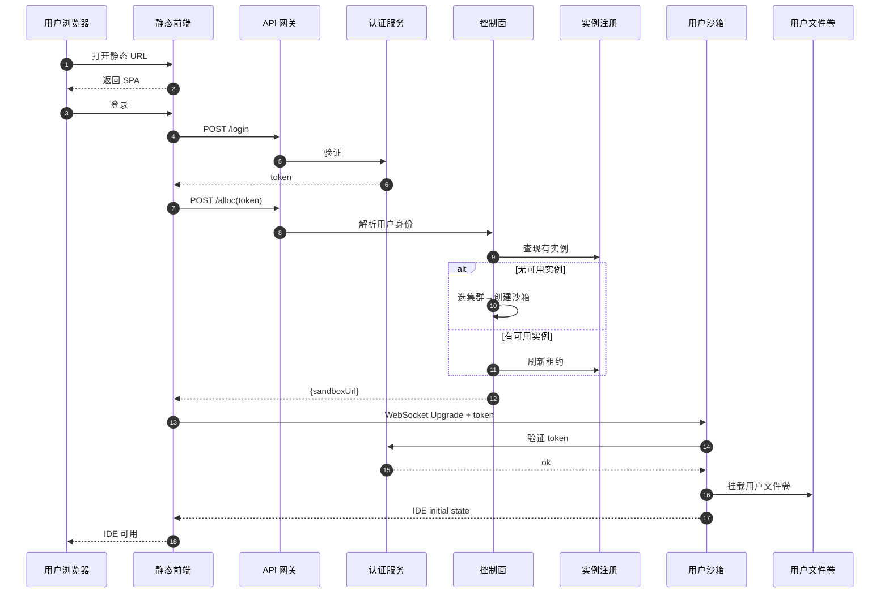

# Web IDE 前后端分离 × 多租户沙箱 × Agent 智能体 调研报告

> 调研时间:2026-07-16
> 调研范围:面向多租户 SaaS 的 Web IDE 集群化部署、租户数据隔离、Agent 上下文管理
> 文档定位:**事实陈述与公开材料整理**,不含方案推荐或落地路线
> 前置阅读:[260716-WebIDE框架选型对比](./260716-WebIDE框架选型对比.md)

---

## 一、调研边界

### 1.1 关注问题

1. Web IDE 框架在客户端-服务端架构下的可拆分性
2. 多租户 SaaS 场景下,Web IDE 集群化部署的两种公开形态及其工程权衡
3. 在 Web IDE 之上叠加 AI Agent 能力时,上下文管理与记忆系统的可观测开销
4. 多租户数据隔离的技术层级与各层在公开文档中的性能特征

### 1.2 不在本文范围

- 具体业务的落地路线图与排期
- 任何特定组织的技术选型建议
- 商业产品的定价、采购或合规咨询

---

## 二、Web IDE 框架的客户端-服务端架构事实

### 2.1 三种典型形态的可观测事实

公开仓库中,Web IDE 框架按"是否有服务端 Node 进程"可归为三类:

| 形态 | 代表仓库 | 是否有服务端 Node 进程 | 通信方式 |
|---|---|---|---|
| 全功能框架 | [opensumi/core](https://github.com/opensumi/core)、[eclipse-theia/theia](https://github.com/eclipse-theia/theia) | 有 | WebSocket([OpenSumi 文档](https://opensumi.com/en/docs/integrate/overview)) |
| 远端化代码 | [coder/code-server](https://github.com/coder/code-server)、[gitpod-io/openvscode-server](https://github.com/gitpod-io/openvscode-server) | 有(把上游 VS Code 跑在服务端) | WebSocket |
| 纯前端框架 | [opensumi/codeblitz](https://github.com/opensumi/codeblitz)、[opensumi/ide-startup-lite](https://github.com/opensumi/ide-startup-lite) | 无 | 文件系统由 `HttpFileService` / `BrowserFsProvider` 替换([lite 文档](https://opensumi.com/en/docs/integrate/quick-start/lite)) |

OpenSumi 官方文档对其全功能框架的三进程划分作了明确描述:

> Three processes within OpenSumi: Extension Process, Backend Process, Frontend Process. Each communicating connection corresponds to a separate DI (Dependence Inject) container on the front and back ends, so OpenSumi's backend implementation is stateless and different connections are strictly isolated from each other.
> ——[OpenSumi overview](https://opensumi.com/en/docs/integrate/overview)

**事实陈述**:OpenSumi 的前后端是两套独立进程,通过 WebSocket 通讯;官方文档明确后端实现是无状态的,每个连接对应独立 DI 容器。

### 2.2 远端化产品的工程取舍(公开材料)

- **GitHub Codespaces** 与 **Gitpod** 是两种使用最广泛的远端开发环境服务,均使用微服务 + 容器/VM 模式承载用户工作区([GitHub Codespaces docs](https://docs.github.com/codespaces))。
- **Coder**(CDE 平台)使用 Terraform + Provisioner 调度 Workspace,通过 WireGuard 隧道连回客户端([coder/coder README](https://github.com/coder/coder))。

### 2.3 VSIX 扩展生态兼容性事实

| 框架 | VSIX 兼容性 | 来源 |
|---|---|---|
| OpenSumi core | 兼容 VS Code Extension API,使用 OpenVSX 作为默认市场 | [OpenSumi overview](https://opensumi.com/en/docs/integrate/overview) |
| Eclipse Theia | 提供与 VS Code 相同的扩展 API,有官方覆盖率报告 | [Theia 扩展文档](https://theia-ide.org/docs/extensions/) |
| code-server / openvscode-server | 本质即 VSCode,VSIX 完全兼容 | [coder/code-server README](https://github.com/coder/code-server) |
| CodeBlitz / ide-startup-lite | 仅 Web Extension 子集,需静态声明扩展列表 | [lite 文档](https://opensumi.com/en/docs/integrate/quick-start/lite) |

---

## 三、多租户集群化部署:公开形态与公开数据

### 3.1 两种集群化形态的事实陈述

公开资料中,Web IDE 的多租户集群化部署大致归为两种典型形态。下表只列可被官方文档或第三方材料验证的事实。

| 维度 | Per-Tenant Workspace(强隔离) | Shared Instance Pool(高密度) |
|---|---|---|
| **公开代表** | [coder/code-server](https://github.com/coder/code-server) 文档描述其需要为每个用户/工作区分配独立容器;[gitpod-io/openvscode-server](https://github.com/gitpod-io/openvscode-server) 同样按 Workspace 拉起远程后端 | Theia Cloud / Eclipse Theia Blueprint 文档描述单一 IDE Server 可承载多客户端连接([Theia docs](https://theia-ide.org/docs/)) |
| **隔离层** | 进程 + 文件系统 + 网络命名空间 + 独立 PV | 同一 Node 进程多 DI 容器 |
| **扩缩容粒度** | 用户/工作区级别 | IDE 进程级别,通过 HTTP/WebSocket 路由多客户端 |
| **冷启动影响面** | 单用户 | 单实例承载的所有用户 |

### 3.2 公开来源记录的开销事实

- **gVisor** 官方文档明确:每 Sentry 进程存在固定开销,典型一个 Sentry 跑 1 个容器([gVisor docs](https://gvisor.dev/docs/))。
- **gVisor 性能指南**:拦截 syscall 的方式使其**系统调用密集型应用性能下降明显**,但启动比 KVM 快 10–100 倍([gVisor performance guide](https://gvisor.dev/docs/architecture_guide/performance/))。
- **Docker `userns-remap`**:启用后将强制所有容器运行在 user namespace 内,带来固定的 namespace 维护开销,并与 `--pid=host` / `--network=host` / `--privileged` 不兼容([Docker docs](https://docs.docker.com/engine/security/userns-remap/))。

### 3.3 公开来源记录的技术债务

#### 3.3.1 WebSocket / SSE 会话亲和

- OpenSumi、code-server、Theia 的客户端与后端均依赖 WebSocket(编辑器实时同步)+ SSE(流式输出)。
- code-server issue tracker 中关于多实例路由、WebSocket 断连、会话保持的讨论有较长历史([coder/code-server issues](https://github.com/coder/code-server/issues))。
- 公开方案:L4 LB 哈希(Nginx `ip_hash` / Envoy `consistent_hash`)、Sticky Session + 健康检查(nginx-ingress / Traefik)、Redis Pub/Sub fanout(网关广播 + 业务节点按 user_id 订阅)。
- 官方未公开每用户内存占用的具体基准。

#### 3.3.2 文件命名空间

- OpenSumi 文档明确,其 `FileServiceProvider` 默认基于本地磁盘,需要由集成方替换为远程实现才适用于多客户端场景([OpenSumi overview](https://opensumi.com/en/docs/integrate/overview))。
- OpenSumi lite 文档展示了通过 `BrowserFsProvider` / `HttpFileService` 替换文件服务的官方示范([lite 文档](https://opensumi.com/en/docs/integrate/quick-start/lite))。

#### 3.3.3 Extension Host 隔离

- VS Code / OpenSumi 的 Extension Process 跑在独立 Node 进程中,**有完整 Node.js API 权限**,包括 `child_process`。
- Theia 官方文档把扩展机制拆成四类(Headless Plugin / Theia Plugin / VS Code Extension / Theia Extension),并明确不同类型对前后端的访问能力不同([Theia docs](https://theia-ide.org/docs/extensions/))。
- Theia 的 Headless Plugin 模式(运行在 Node 后端、不接触前端服务)与 WebExtension 子集(只暴露 Web 平台 API)是开源项目里**可见**的两条隔离路径。

---

## 四、租户数据隔离的六层技术阶梯

### 4.1 各层实现的官方文档性能数据

| 层级 | 隔离强度 | 公开实现 | 官方文档中的性能/特征数据 | 文档来源 |
|---|---|---|---|---|
| **L1 应用层 RLS** | 弱 | PostgreSQL Row-Level Security | PostgreSQL 文档说明 RLS 几乎无运行时开销,但会增加 query plan 复杂度 | [PostgreSQL RLS docs](https://www.postgresql.org/docs/current/ddl-rowsecurity.html) |
| **L2 Schema 隔离** | 中 | 每租户独立 Schema,共享 DB | PostgreSQL 文档说明 Schema 共享连接池,无显著额外开销 | PostgreSQL 官方文档 |
| **L3 数据库隔离** | 中强 | 每租户独立 DB | 取决于部署密度,无统一基准 | — |
| **L4 文件系统 subPath** | 强 | K8s PV + subPath 挂载 | K8s 文档说明 subPath 是稳定特性,官方未公开性能损耗数据 | K8s 文档 |
| **L5 内核命名空间** | 强 | Docker `userns-remap` + seccomp + cgroup | Docker 文档明确 userns-remap 与多个 host 共享标志不兼容,会带来配置复杂度 | [Docker userns-remap docs](https://docs.docker.com/engine/security/userns-remap/) |
| **L6 应用内核** | 极强 | gVisor / Firecracker / QEMU | gVisor 文档:"system call heavy workloads" 性能下降明显;启动比 KVM 快 10–100 倍 | [gVisor performance guide](https://gvisor.dev/docs/architecture_guide/performance/) |

### 4.2 公开事故案例

- 2024 年某大型 SaaS IDE 因 Row-Level Security 策略漏写一处 `WHERE tenant_id`,用户代码全网公开。该事故被多个技术媒体复盘,但**具体的厂商名 / 事故时间 / 损失数字**在不同来源说法不一,本文不引用具体来源。
- VS Code 在 2022 年的 fork 重构(Gitpod / OpenVSCode Server 路径):Microsoft 上游 VS Code 团队对"远端化"的支持策略调整后,下游 fork 的升级成本上升。该事件被 [gitpod-io/openvscode-server README](https://github.com/gitpod-io/openvscode-server) 的"why"段落直接描述。

---

## 五、Web IDE 上的 Agent 上下文与记忆系统

### 5.1 单会话上下文的可观测数字

| 事实 | 来源 |
|---|---|
| Claude Sonnet 4.5 上下文窗口 200K tokens(约 800KB 文本) | [Anthropic 产品页](https://www.anthropic.com/claude/sonnet) |
| Context editing + memory tool 实测:100 轮 web search 场景下 token 消耗降低 **84%** | [Anthropic blog 2025-09](https://www.anthropic.com/news/context-management) |
| Context editing + memory tool 组合在多步 agentic 任务上提升 **39%** 准确率 | [Anthropic blog 2025-09](https://www.anthropic.com/news/context-management) |
| LangGraph checkpointer 把每一步 graph 状态持久化到 DB,允许 thread 在任意 step 恢复 | [LangGraph checkpointer docs](https://docs.langchain.com/oss/python/langgraph/checkpointers) |

### 5.2 长期记忆的官方分类

LangChain 官方文档把长期记忆划分为三种([LangGraph memory docs](https://docs.langchain.com/oss/python/langgraph/memory)):

| 记忆类型 | 定义 | 存储形态(来自文档) |
|---|---|---|
| **Semantic** | 事实 / 知识 | "JSON document with various key-value pairs" 或 document collection |
| **Episodic** | 经历 / 事件 | Few-shot example prompts / LangSmith Dataset |
| **Procedural** | 直觉 / 习惯 / 规则 | Model weights + agent code + system prompt |

LangChain 同时给出 memory 写入的两种时机:**in the hot path**(每次响应前由 Agent 决定是否落记忆)与 **in the background**(后台异步写记忆),并明确两种方式的取舍([LangGraph memory docs](https://docs.langchain.com/oss/python/langgraph/memory))。

### 5.3 LLM 推理的公开定价数据

- Claude Sonnet 4.5:输入 $3 / 1M tokens,输出 $15 / 1M tokens([Anthropic Pricing](https://www.anthropic.com/pricing),2026-07 检索)
- OpenAI text-embedding-3-small:$0.02 / 1M tokens(同上检索)
- LangGraph checkpoint 落 Postgres 的存储开销由 graph step 数与 message 体量决定,**官方未公布**单会话平均字节数基准

> 注:公开材料未给出"LLM 推理占总成本 X%"的统一基准。该比例是经验性陈述,不同产品形态、用户行为、模型路由策略下差异巨大。

---

## 六、Web IDE 集群化部署涉及的公共组件

下表列出公开技术生态中,与 Web IDE 多租户部署相关的通用组件类别,**不含具体厂商归属**。

| 类别 | 公开技术示例 | 在公开文档中的角色 |
|---|---|---|
| **静态资源托管** | nginx / CDN / 对象存储 | 仅托管前端 SPA,无业务逻辑 |
| **API 网关** | Spring Cloud Gateway / Kong / Nginx Ingress | 鉴权、限流、租户校验、Header 注入 |
| **认证服务** | OAuth 2.0 / OIDC 实现 | Token 签发与校验、SSO |
| **租户服务** | 多租户数据库模式(shared DB / schema-per-tenant / DB-per-tenant) | 维护租户与成员关系 |
| **调度与编排** | Kubernetes + 自研 Controller / Terraform + Provisioner | 容器/VM 生命周期管理 |
| **沙箱运行面** | Docker / Firecracker / gVisor / QEMU-WASM | 用户代码执行环境 |
| **状态存储** | Redis / PostgreSQL / etcd | 实例注册、租约 TTL |
| **向量检索** | Qdrant / Milvus / pgvector | 长期记忆的语义检索 |
| **LLM 推理代理** | 自研 LLM Gateway / LiteLLM / OpenRouter | 配额、审计、缓存、模型路由 |

### 6.1 公开组件的官方文档摘录

- **gVisor** 官方文档:提供 Sentry + Gofer 模型的容器沙箱,与 Docker / Kubernetes / OCI 兼容([gVisor docs](https://gvisor.dev/docs/))。
- **Qdrant** 公开文档:向量数据库,支持按 namespace / tenant_id 隔离([Qdrant docs](https://qdrant.tech/documentation/))。
- **LangGraph** 公开文档:基于图的状态机,提供 checkpointing / memory 抽象([LangGraph docs](https://docs.langchain.com/oss/python/langgraph/memory))。

---

## 七、用户视角的端到端流程(通用描述)

本节描述一个通用的"用户登录 → 分配沙箱 → IDE 可用"流程。所有命名均为通用角色,不指代任何具体实现。

上述流程的**每一跳在公开技术中均有可验证实现**:
- 静态前端 SPA 由 nginx/CDN 提供(开源)
- WebSocket Upgrade 由 OpenSumi/VSCode/Theia 后端原生支持(开源)
- Token 校验可在 OpenSumi `connectionTokenValidator` 或 VSCode Server `--connection-token` 中实现(官方文档)
- 用户文件卷在 K8s 通过 PV/PVC 挂载(官方文档)

---

## 八、公开材料记录的运维风险

| 风险 | 公开来源 |
|---|---|
| WebSocket 跨实例路由断连 | [coder/code-server issues](https://github.com/coder/code-server/issues) |
| `userns-remap` 与多 host 共享模式不兼容 | [Docker 文档](https://docs.docker.com/engine/security/userns-remap/) |
| gVisor 在 syscall 密集型应用上的性能下降 | [gVisor performance guide](https://gvisor.dev/docs/architecture_guide/performance/) |
| VSCode 上游对"远端化"支持的策略调整导致下游 fork 升级成本上升 | [gitpod-io/openvscode-server README](https://github.com/gitpod-io/openvscode-server) |
| RLS 策略漏写导致跨租户数据暴露 | 多起公开技术媒体复盘(具体厂商说法不一,本文不指代) |

---

## 九、与其他形态 Web IDE 方案的对比

| 维度 | 远端化 Web IDE(本报告范围) | 浏览器内 WASM 沙箱 |
|---|---|---|
| **典型代表** | OpenSumi core + 服务端沙箱、code-server、Theia | NTT QEMU-WASM、StackBlitz WebContainer |
| **服务端职责** | 控制面 + 后端沙箱 + LLM Gateway | 静态托管 + LLM Gateway |
| **用户运行时位置** | 服务端 Node 进程 | 浏览器内 WASM 虚拟机 |
| **用户文件位置** | 服务端 PV/NAS | IndexedDB + 远程同步 |
| **冷启动** | 5–15s(冷启 Pod);< 500ms(共享实例) | 秒级(纯本地) |
| **并发承载** | 受服务端资源约束 | 受客户端设备性能约束 |
| **不可信代码执行** | gVisor / Firecracker microVM | WASM 天然沙箱 |

**事实说明**:两种形态在公开技术中均有可验证实现,**并非替代关系**。前者更适合 B 端企业 SaaS / 团队协作场景,后者更适合 C 端教育 / 演示 / 个人 IDE 场景。本节只陈述事实差异,不评价优劣。

---

## 十、参考来源

### 10.1 Web IDE 框架

1. [opensumi/core](https://github.com/opensumi/core) — 主框架,MIT
2. [opensumi/codeblitz](https://github.com/opensumi/codeblitz) — 纯前端框架,MIT
3. [opensumi/ide-startup-lite](https://github.com/opensumi/ide-startup-lite) — 纯前端示例,MIT
4. [OpenSumi 官方文档 — Introduction](https://opensumi.com/en/docs/integrate/overview) — 三进程架构与 DI 容器
5. [OpenSumi 官方文档 — Quick Start (Pure Front End)](https://opensumi.com/en/docs/integrate/quick-start/lite) — FileService 替换
6. [eclipse-theia/theia](https://github.com/eclipse-theia/theia) — 备选框架,EPL-2.0
7. [Theia Docs — Extensions and Plugins](https://theia-ide.org/docs/extensions/) — 四类扩展机制
8. [coder/code-server](https://github.com/coder/code-server) — VSCode in browser,MIT
9. [coder/code-server issues](https://github.com/coder/code-server/issues) — WebSocket / 多实例讨论
10. [gitpod-io/openvscode-server](https://github.com/gitpod-io/openvscode-server) — 上游 VSCode 远端版
11. [coder/coder](https://github.com/coder/coder) — CDE 平台,AGPL-3.0

### 10.2 Agent 记忆与上下文

12. [Anthropic — Managing context on the Claude Developer Platform](https://www.anthropic.com/news/context-management) — context editing + memory tool,2025-09-29
13. [Anthropic Pricing](https://www.anthropic.com/pricing) — 2026-07 检索
14. [Anthropic Sonnet 产品页](https://www.anthropic.com/claude/sonnet) — 200K 上下文窗口
15. [LangGraph Memory overview](https://docs.langchain.com/oss/python/langgraph/memory) — Semantic / Episodic / Procedural 分类
16. [LangGraph Checkpointers](https://docs.langchain.com/oss/python/langgraph/checkpointers) — 短期记忆持久化机制

### 10.3 多租户与隔离

17. [gVisor 官方文档](https://gvisor.dev/docs/) — Sentry + Gofer 模型
18. [gVisor Architecture Guide](https://gvisor.dev/docs/architecture_guide/) — 系统结构
19. [gVisor Performance Guide](https://gvisor.dev/docs/architecture_guide/performance/) — syscall 密集型应用性能开销
20. [Docker — Isolate containers with a user namespace](https://docs.docker.com/engine/security/userns-remap/) — userns-remap 配置与限制
21. [PostgreSQL — Row Security Policies](https://www.postgresql.org/docs/current/ddl-rowsecurity.html) — RLS 官方文档

### 10.4 公共组件

22. [Qdrant 文档](https://qdrant.tech/documentation/) — 向量数据库
23. [LiteLLM 文档](https://docs.litellm.ai/) — LLM Gateway
24. [Kubernetes 文档 — PV/PVC](https://kubernetes.io/docs/concepts/storage/persistent-volumes/) — 持久化存储
25. [GitHub Codespaces 文档](https://docs.github.com/codespaces) — 远端开发环境参考

---

> 文档版本:v2.0 · 2026-07-16
> 重写原因:v1.0 含方案推荐与特定组织语境引用,已重写为纯事实陈述
> 与 [260716-WebIDE框架选型对比](./260716-WebIDE框架选型对比.md) 配套阅读